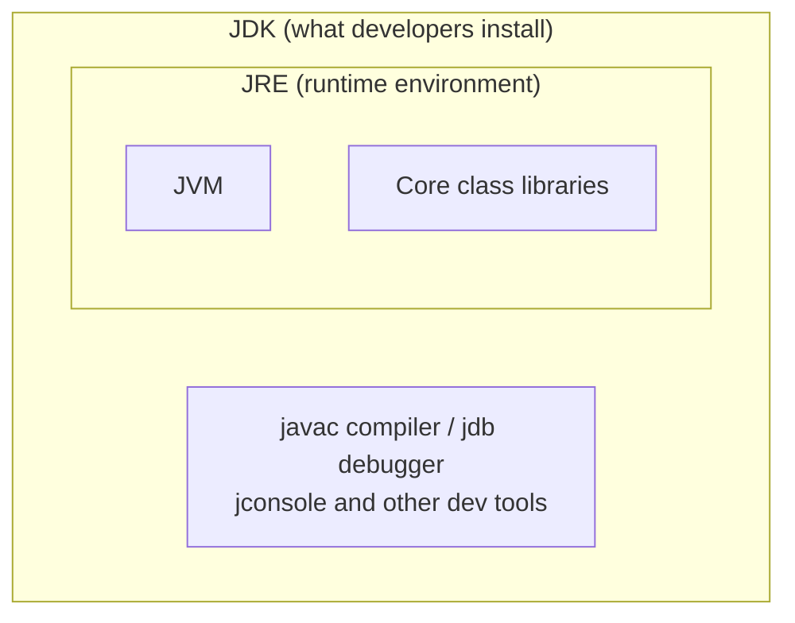
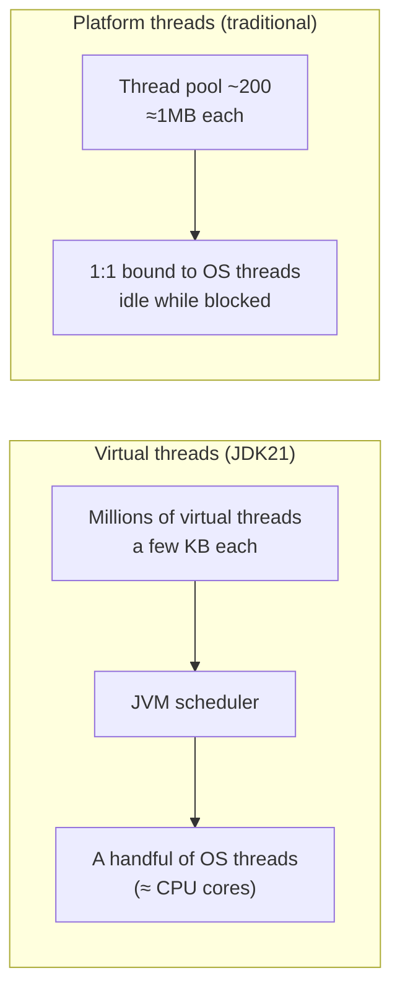

> **This is part 1 of the "JDK21 and Spring in Action" series.**
> After reading you will know: what the JDK is, why this series is built on
> JDK21, and which JDK21 features matter and what problems they solve.
> This post aims for the big picture; each feature gets its own deep dive
> later in the series.

## 1. Before We Start: What Exactly Is the JDK

Beginners are often confused by three acronyms: **JVM, JRE, JDK**. One
analogy clears it up —

- **JVM** (Java Virtual Machine): a "translation machine". Java code is
  compiled into bytecode, and the JVM translates it into instructions your
  actual computer can execute. Because every OS has its own JVM, Java can
  "write once, run anywhere".
- **JRE** (Runtime Environment): the translation machine plus a box of
  common parts (the core class libraries). Enough to **run** other people's
  programs, nothing more.
- **JDK** (Development Kit): all of the above plus developer tools (the
  `javac` compiler, debugger, etc.). **This is what developers install.**



"JDK21" simply means the 21st major release of this toolkit.

## 2. Why JDK21: The Meaning of LTS

Java ships a new release every six months, but **most releases are only
maintained for six months**, so companies avoid them. Only **LTS (Long-Term
Support) releases** are maintained for years, and production systems almost
exclusively run LTS. Recent LTS releases:

| Version | Released | Significance |
|------|---------|------|
| JDK 8 | 2014 | The classic; huge legacy footprint to this day |
| JDK 11 | 2018 | First modern LTS |
| JDK 17 | 2021 | Minimum requirement for Spring Boot 3.x |
| **JDK 21** | **2023-09** | **Star of this series: virtual threads go final** |
| JDK 25 | 2025-09 | Newest LTS; ecosystem still catching up |

Why this series picks JDK21:

1. It is the release where **virtual threads became final** — Java's most
   important concurrency upgrade in a decade;
2. Spring Boot 3.2+ gives it first-class support; the ecosystem is mature;
3. As an LTS it will stay relevant for years, and it is what employers
   currently ask for.

## 3. The Headliner: Virtual Threads

### 3.1 The problem they solve

Picture a web server as a restaurant: **threads are waiters**, requests are
customers.

Traditional Java threads (platform threads) map one-to-one onto OS threads,
and they are **expensive**: each reserves about 1 MB of stack by default,
and a few thousand of them will strain the system. So the standard practice
was to hire a fixed staff (a thread pool, say 200). Here is the problem:
after taking an order, a customer waits on the kitchen (a database query, a
call to another service) — and the waiter just **stands at the table doing
nothing**, while you still pay his wages. When customers pour in, all 200
waiters are stuck waiting on the kitchen, and new customers queue at the
door even though tables and the kitchen have spare capacity.

**Virtual threads** are like installing a dispatch system: after handing the
order to the kitchen, the waiter **immediately goes to serve someone else**;
when the dish is ready, any free waiter delivers it. Virtual threads are
managed by the JVM rather than the OS, each takes only a few KB, and
**a million of them is not a problem** — so the most intuitive style,
"one thread per request", can finally survive high concurrency.



### 3.2 What the code looks like

```java
import java.time.Duration;
import java.util.concurrent.Executors;

public class VirtualThreadDemo {
    public static void main(String[] args) {
        // One virtual thread per task — 100k tasks submitted with ease
        try (var executor = Executors.newVirtualThreadPerTaskExecutor()) {
            for (int i = 0; i < 100_000; i++) {
                int taskId = i;
                executor.submit(() -> {
                    Thread.sleep(Duration.ofSeconds(1)); // simulate blocking IO
                    return taskId;
                });
            }
        } // try-with-resources waits for all tasks on close
        System.out.println("100k tasks done");
    }
}
```

Run the same code on a platform-thread pool and it is either far slower or
triggers memory alarms. Better still: **enabling virtual threads in Spring
Boot takes exactly one line of configuration**, with zero changes to your
controllers (demonstrated in part 2).

## 4. Three Features That Make Code Elegant

### 4.1 record: a data class in one line

Defining a class that "just holds data" used to mean dozens of lines of
fields, constructor, getters, equals, hashCode, toString. Since JDK14,
`record` does it in one line — and the result is immutable by design:

```java
// This one line ≈ 50 lines of the old way
public record User(Long id, String name, String email) {}

var user = new User(1L, "Leopard", "leopard@example.com");
System.out.println(user.name()); // leopard
```

Backend DTOs (request/response objects) are a perfect fit; this series uses
records throughout.

### 4.2 sealed + switch pattern matching: modeling states safely

`sealed` restricts which implementations an interface may have; combined
with **switch pattern matching** (final in JDK21), the compiler checks that
you haven't missed a branch:

```java
sealed interface Shape permits Circle, Rectangle {}
record Circle(double radius) implements Shape {}
record Rectangle(double width, double height) implements Shape {}

double area(Shape shape) {
    return switch (shape) {
        case Circle c -> Math.PI * c.radius() * c.radius();
        case Rectangle r -> r.width() * r.height();
        // No default needed: the compiler knows Shape has exactly two kinds,
        // and a missing branch is a compile error
    };
}
```

Think of an order system's "pending / paid / shipped / completed" states —
model them this way and adding a new state turns every unhandled spot into a
compile-time error instead of a production incident.

### 4.3 SequencedCollection: collections finally get first/last

A small but delightful improvement. Getting the last element of a List used
to be `list.get(list.size() - 1)`. Now:

```java
List<String> list = new ArrayList<>(List.of("a", "b", "c"));
list.getFirst();  // "a"
list.getLast();   // "c"
list.reversed();  // [c, b, a] (reversed view)
```

## 5. Also Worth Knowing

| Feature | One-liner | Status |
|------|-----------|------|
| Generational ZGC | Sub-millisecond GC pauses; enable with `-XX:+UseZGC -XX:+ZGenerational` | Final |
| Structured concurrency | Manage a group of concurrent tasks as one unit; cancel together on failure | Preview |
| Scoped Values | Immutable data sharing across threads; the modern ThreadLocal | Preview |
| String templates | Interpolation like `STR."Hello \{name}"` | Preview (later reworked; just be aware) |

> **Note**: features marked "Preview" are off by default and may change —
> keep them out of production code. This series only uses final features.

## 6. Recap

- JDK = JVM + class libraries + dev tools; production runs **LTS** releases,
  and this series is built on **JDK21**;
- **Virtual threads** let the intuitive one-thread-per-request style handle
  high concurrency — the number one reason to choose JDK21;
- **record / sealed + pattern matching / SequencedCollection** make everyday
  code shorter and safer;
- Watch preview features from a distance for now.

**Next up**: *Choosing a Spring Version and Your First Web Project* — we
install JDK21, get a web endpoint running in 15 minutes, and see with our
own eyes that virtual threads are doing the work.
