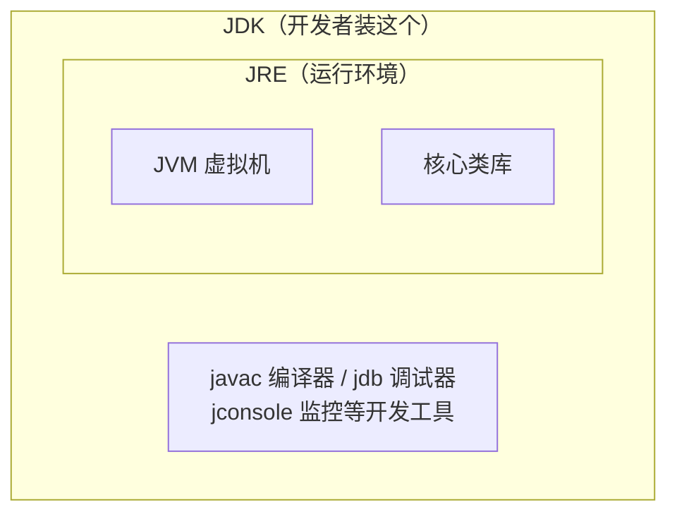
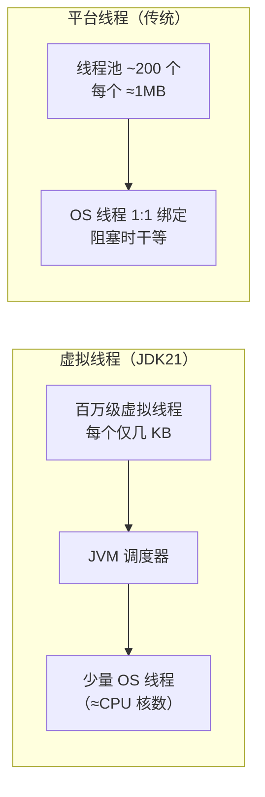

> **这是「JDK21 与 Spring 实战」系列的第 1 篇。**
> 读完本文你将知道：JDK 是什么、为什么这个系列选择 JDK21、
> 以及 JDK21 最值得关注的几个特性分别解决了什么问题。
> 本文只求"看懂全景"，每个特性的深入用法会在后续文章逐个展开。

## 一、开始之前：JDK 到底是什么

刚入门的同学常被三个缩写绕晕：**JVM、JRE、JDK**。用一个比喻就清楚了——

- **JVM**（Java 虚拟机）：一台"翻译机"。Java 代码编译后的字节码，由它翻译成
  你电脑真正能执行的指令。正因为各操作系统都有对应的 JVM，Java 才能"一次编写，到处运行"。
- **JRE**（运行环境）：翻译机 + 一箱常用零件（核心类库）。**只够运行**别人写好的程序。
- **JDK**（开发工具包）：以上全部 + 开发工具（编译器 `javac`、调试器等）。**开发必装的就是它**。



所谓 "JDK21"，就是这套工具包的第 21 个大版本。

## 二、为什么选 JDK21：LTS 的含义

Java 每半年发一个新版本，但**大多数版本只维护半年**，企业不敢用。
只有 **LTS（Long-Term Support，长期支持）版本**会被维护很多年，
生产环境几乎只用 LTS。近年的 LTS 版本：

| 版本 | 发布时间 | 地位 |
|------|---------|------|
| JDK 8 | 2014 | 一代经典，至今仍有大量存量系统 |
| JDK 11 | 2018 | 第一个现代化 LTS |
| JDK 17 | 2021 | Spring Boot 3.x 的最低要求 |
| **JDK 21** | **2023.09** | **本系列主角：虚拟线程正式落地** |
| JDK 25 | 2025.09 | 最新 LTS，生态仍在跟进中 |

选 JDK21 的理由很简单：

1. 它是**虚拟线程正式转正**的版本——这是 Java 近十年最重要的并发升级；
2. Spring Boot 3.2 起对它有一等支持，生态成熟；
3. 作为 LTS，学了不会很快过时，找工作也是当前主流要求。

## 三、头号明星：虚拟线程（Virtual Threads）

### 3.1 它解决什么问题

把 Web 服务器想象成一家餐厅，**线程就是服务员**，请求就是客人。

传统 Java 线程（平台线程）直接对应操作系统线程，**很贵**：每个默认占约 1MB 栈内存，
创建几千个系统就吃不消。于是传统做法是雇固定数量的服务员（线程池，比如 200 个）。
问题来了：客人点完菜要等厨房（数据库查询、调用其他服务），
服务员却只能**站在桌边干等**——什么都不干，但你还得付他工资。
客人一多，200 个服务员全在等菜，新客人只能排队，哪怕厨房和餐桌都空着。

**虚拟线程**相当于给餐厅装了一套调度系统：服务员把菜单交给厨房后**立刻去接待别的客人**，
菜好了任何空闲服务员都能端上桌。虚拟线程由 JVM 而非操作系统管理，
每个只占几 KB，**开一百万个都没问题**——"一个请求一个线程"这种最直观的写法，
终于可以支撑高并发了。



### 3.2 代码长什么样

```java
import java.time.Duration;
import java.util.concurrent.Executors;

public class VirtualThreadDemo {
    public static void main(String[] args) {
        // 每个任务一个虚拟线程，10 万个任务轻松提交
        try (var executor = Executors.newVirtualThreadPerTaskExecutor()) {
            for (int i = 0; i < 100_000; i++) {
                int taskId = i;
                executor.submit(() -> {
                    Thread.sleep(Duration.ofSeconds(1)); // 模拟 IO 等待
                    return taskId;
                });
            }
        } // try-with-resources 结束时自动等待全部任务完成
        System.out.println("10 万个任务完成");
    }
}
```

同样的代码换成平台线程池，要么慢得多，要么直接内存告警。
更妙的是：**在 Spring Boot 里启用虚拟线程只需一行配置**，你的 Controller 代码一字不改
（第 2 篇会实际演示）。

## 四、让代码变优雅的三兄弟

### 4.1 record：一行写完数据类

以前定义一个"只是装数据"的类，要写字段、构造器、getter、equals、hashCode、toString
几十行；JDK14+ 的 `record` 一行搞定，且天生不可变：

```java
// 这一行 ≈ 过去的 50 行
public record User(Long id, String name, String email) {}

var user = new User(1L, "Leopard", "leopard@example.com");
System.out.println(user.name()); // 取值：leopard
```

后端开发里大量的 DTO（接口的请求/响应对象）都适合用它，本系列会全程使用。

### 4.2 sealed + switch 模式匹配：状态建模利器

`sealed`（密封类型）限定一个接口只能有哪些实现；配合 JDK21 转正的
**switch 模式匹配**，编译器能帮你检查"是否漏了分支"：

```java
sealed interface Shape permits Circle, Rectangle {}
record Circle(double radius) implements Shape {}
record Rectangle(double width, double height) implements Shape {}

double area(Shape shape) {
    return switch (shape) {
        case Circle c -> Math.PI * c.radius() * c.radius();
        case Rectangle r -> r.width() * r.height();
        // 不需要 default：编译器知道 Shape 只有这两种，漏写会直接编译报错
    };
}
```

想想订单系统的"待支付/已支付/已发货/已完成"——用它建模，
新增状态时所有没处理的地方编译期就会报错，而不是上线后炸。

### 4.3 SequencedCollection：集合终于有了"第一个/最后一个"

一个小而美的改进。以前取 List 最后一个元素要写 `list.get(list.size() - 1)`，现在：

```java
List<String> list = new ArrayList<>(List.of("a", "b", "c"));
list.getFirst();  // "a"
list.getLast();   // "c"
list.reversed();  // [c, b, a]（倒序视图）
```

## 五、其他值得知道的

| 特性 | 一句话说明 | 状态 |
|------|-----------|------|
| 分代 ZGC | 停顿时间亚毫秒级的垃圾回收器，加 `-XX:+UseZGC -XX:+ZGenerational` 启用 | 正式 |
| 结构化并发 | 把一组并发任务当作一个整体管理，出错统一取消 | 预览 |
| Scoped Values | 线程间共享不可变数据，ThreadLocal 的现代替代 | 预览 |
| 字符串模板 | `STR."你好 \{name}"` 式的插值语法 | 预览（后续版本有反复，了解即可） |

> **注意**：标着"预览（Preview）"的特性默认关闭、后续可能变动，
> 生产代码先别用。本系列正文只使用正式特性。

## 六、小结

- JDK = JVM + 类库 + 开发工具；生产环境用 **LTS 版本**，本系列基于 **JDK21**；
- **虚拟线程**让"一个请求一个线程"的直观写法支撑高并发，是选择 JDK21 的头号理由；
- **record / sealed + 模式匹配 / SequencedCollection** 让日常代码更短、更安全；
- 预览特性一律先观望。

**下一篇**：《Spring 版本选择与第一个 Web 项目》——我们把 JDK21 装上，
15 分钟跑起第一个 Web 接口，并亲眼验证虚拟线程真的在工作。
