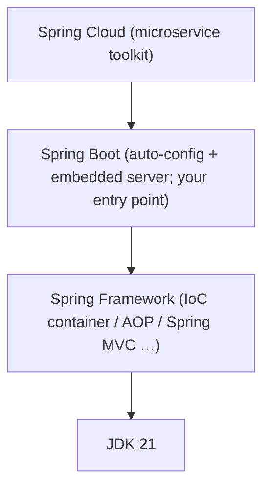
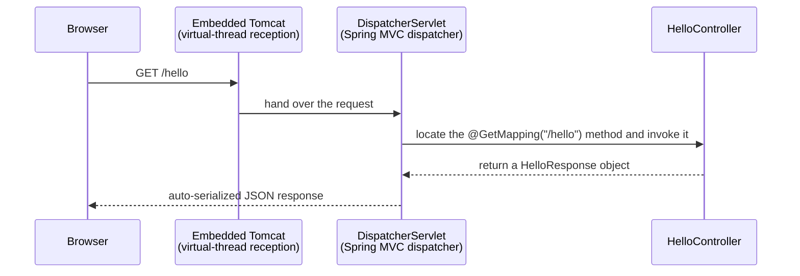

> **This is part 2 of the "JDK21 and Spring in Action" series**
> ([part 1: A Tour of JDK21's Key Features](../01-jdk21-features/)).
> After reading you will: tell the Spring family members apart, know how to
> pick versions, and have a real web endpoint running on your machine —
> with virtual threads visibly handling requests.

## 1. The Spring Family: Who Is Who

Open any job posting and the parade of names — Spring, Spring MVC, Spring
Boot, Spring Cloud — is instantly overwhelming. A house-building analogy:

- **Spring Framework**: the foundation and load-bearing structure. Its core
  is the IoC container (which manages your objects) plus a pile of
  infrastructure. Powerful, but a **bare shell** — you configure everything
  yourself.
- **Spring MVC**: the part of Spring Framework that "greets visitors" — the
  web framework handling HTTP requests.
- **Spring Boot**: **fully furnished, move right in**. It does not replace
  Spring; it pre-configures all the tedious parts ("convention over
  configuration") and embeds a web server, so one command starts your site.
  **Developing Spring applications today means using Spring Boot.**
- **Spring Cloud**: the neighborhood property-management system — when your
  system splits into many services (microservices), it handles service
  discovery, configuration, gateways and so on. We won't need it until
  phase four of this series.



**Takeaway: our entry point is Spring Boot**, and learning it naturally
teaches the Spring Framework underneath.

## 2. Picking Versions

| Spring Boot | Requires JDK | JDK21 support |
|---|---|---|
| 2.7.x (end of life) | 8+ | None — avoid for new projects |
| 3.2 – 3.4 | 17+ | Virtual threads enabled with one property since 3.2 |
| **3.5.x (this series)** | 17+, 21 recommended | Mature support, rich docs, still maintained |
| 4.x (released late 2025) | 17+ | Very new; third-party ecosystem still catching up |

The selection principle in one sentence: **for both learning and production,
pick the previous stable major version** — new enough, with the potholes
already filled by others. This series is fixed on **JDK 21 + Spring Boot
3.5.x** (use the latest 3.5 patch release; patch versions only fix bugs and
affect none of the code in this series).

## 3. Hands-on: A Web Project in 15 Minutes

### 3.1 Install JDK21

The Eclipse Temurin distribution is recommended (free, no licensing traps):
download JDK 21 (LTS) from https://adoptium.net. Verify:

```bash
java -version
# output should contain: openjdk version "21.x.x"
```

### 3.2 Generate the project skeleton

Spring's official generator lives at **start.spring.io**. Choose:

| Option | Pick | Why |
|---|---|---|
| Project | Maven | Build tool; start with Maven (XML is easy to read) |
| Language | Java | — |
| Spring Boot | 3.5.x | The pre-selected 3.5 stable is fine |
| Java | 21 | The key setting! |
| Packaging | Jar | Embedded server; one runnable jar |
| Dependencies | **Spring Web** | The only dependency this post needs |

Group is your domain reversed (e.g. `com.leopard`), Artifact is the project
name (e.g. `bookstore`). Click **GENERATE**, unzip, and open in an IDE
(IntelliJ IDEA Community Edition is free).

> 💡 You can skip the browser entirely:
> ```bash
> curl https://start.spring.io/starter.zip -d javaVersion=21 -d dependencies=web -d artifactId=bookstore -o bookstore.zip
> ```

### 3.3 A tour of the project layout

Key files only:

```
bookstore/
├── pom.xml                          # the project "manifest": dependencies & versions
├── mvnw / mvnw.cmd                  # Maven wrapper: builds without installing Maven
└── src/
    ├── main/
    │   ├── java/com/leopard/bookstore/
    │   │   └── BookstoreApplication.java   # application entry point
    │   └── resources/
    │       └── application.properties      # configuration (port, database, …)
    └── test/                        # tests
```

The entry class is tiny yet is the heart of the application:

```java
@SpringBootApplication   // one annotation = auto-config + component scan + config class (internals in part 23)
public class BookstoreApplication {
    public static void main(String[] args) {
        SpringApplication.run(BookstoreApplication.class, args);
    }
}
```

### 3.4 Your first endpoint

Create `HelloController.java` next to the entry class:

```java
package com.leopard.bookstore;

import org.springframework.web.bind.annotation.GetMapping;
import org.springframework.web.bind.annotation.RestController;

@RestController              // this class handles HTTP requests; return values become the response body
public class HelloController {

    // a record (from part 1) as the response shape — Spring serializes it to JSON
    record HelloResponse(String message, String thread) {}

    @GetMapping("/hello")    // map GET /hello to the method below
    public HelloResponse hello() {
        return new HelloResponse(
                "Hello, Spring Boot + JDK21!",
                Thread.currentThread().toString()   // expose the current thread — useful in a minute
        );
    }
}
```

### 3.5 Run and verify

From the project root (`mvnw.cmd` on Windows, `./mvnw` on macOS/Linux):

```bash
mvnw.cmd spring-boot:run
```

When you see `Tomcat started on port 8080`, visit
`http://localhost:8080/hello`:

```json
{
  "message": "Hello, Spring Boot + JDK21!",
  "thread": "Thread[#42,http-nio-8080-exec-1,5,main]"
}
```

Congratulations — your first web endpoint is live! Note the `thread` field:
`http-nio-8080-exec-1` is a thread from Tomcat's **platform thread pool**,
exactly the "traditional waiter" from part 1.

### 3.6 Turn on virtual threads with one line

Open `src/main/resources/application.properties` and add:

```properties
spring.threads.virtual.enabled=true
```

Restart and hit `/hello` again:

```json
{
  "message": "Hello, Spring Boot + JDK21!",
  "thread": "VirtualThread[#52,tomcat-handler-0]/runnable@ForkJoinPool-1-worker-1"
}
```

There it is — `VirtualThread`! From this moment, **every request is handled
by a virtual thread**. Your business code stays in the most intuitive
synchronous, blocking style, and the JVM takes care of concurrency. That is
the first dividend of the "JDK21 + Spring Boot" combo: **one line of config,
an architecture upgrade**.

## 4. How That Request Was Handled

A panoramic map to close with — part 24 walks every step in the source code:



## 5. Recap

- Your entry point is **Spring Boot** — the "furnished" Spring Framework;
- Versions: **JDK 21 + Spring Boot 3.5.x**, chosen by the "previous stable
  major" principle;
- start.spring.io → one `@RestController` → `mvnw spring-boot:run`, and an
  endpoint is live;
- `spring.threads.virtual.enabled=true` switches on virtual threads —
  visibly.

**Next up**: *The Java You Need to Read Spring Code* — what annotations
really are, and what roles interfaces and generics play inside Spring,
taught through real Spring code snippets.
