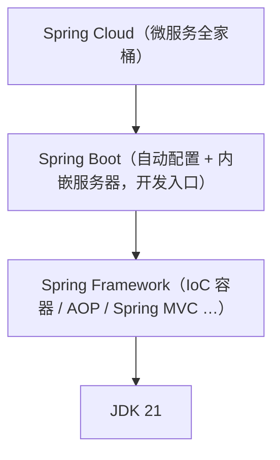
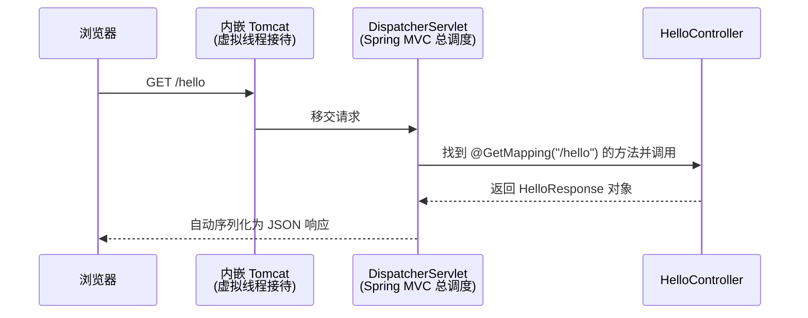

> **这是「JDK21 与 Spring 实战」系列的第 2 篇**（[上一篇：JDK21 核心特性总览](../01-jdk21-features/)）。
> 读完本文你将：分清 Spring 全家桶各成员的关系、知道版本怎么选、
> 并在自己电脑上跑起一个真实的 Web 接口——还会亲眼看到虚拟线程在干活。

## 一、Spring 全家桶：先分清谁是谁

新手打开招聘要求，看到 Spring、Spring MVC、Spring Boot、Spring Cloud 一排名词就头大。
用"造房子"打个比方：

- **Spring Framework**：地基和承重结构。核心是 IoC 容器（帮你管理对象）和一堆基础设施。
  功能强大，但**毛坯房**——什么都要自己配，配置文件写到手软。
- **Spring MVC**：Spring Framework 里负责"接待访客"的那部分——处理 HTTP 请求的 Web 框架。
- **Spring Boot**：**精装修拎包入住**。它不替代 Spring，而是把 Spring 的繁琐配置全部
  预设好（"约定优于配置"），还内置了 Web 服务器，一个命令就能启动网站。
  **今天开发 Spring 应用，默认就是用 Spring Boot。**
- **Spring Cloud**：整个小区的物业系统——当你的系统拆成很多服务（微服务）时，
  负责服务之间的发现、配置、网关等。本系列第四阶段才会用到。



**结论：我们学习和使用的入口是 Spring Boot**，学它的过程中自然会理解底下的 Spring Framework。

## 二、版本怎么选

| Spring Boot 版本 | 要求 JDK | 对 JDK21 的态度 |
|---|---|---|
| 2.7.x（停止维护） | 8+ | 不支持，别再用于新项目 |
| 3.2 ~ 3.4 | 17+ | 3.2 起一行配置启用虚拟线程 |
| **3.5.x（本系列使用）** | 17+，推荐 21 | 支持成熟、文档丰富、仍在维护期 |
| 4.x（2025 年底发布） | 17+ | 较新，第三方生态还在跟进，学习期不选最新 |

选型原则一句话：**学习和生产都选"最新的上一个稳定大版本"**——足够新，坑已被别人踩完。
本系列固定使用 **JDK 21 + Spring Boot 3.5.x**（你实际操作时用 3.5 的最新小版本即可，
小版本只修 bug，不影响本系列任何代码）。

## 三、动手：15 分钟第一个 Web 项目

### 3.1 准备：安装 JDK21

推荐 Eclipse Temurin 发行版（免费、无许可证纠纷）：https://adoptium.net 下载
JDK 21 (LTS) 安装。装好后验证：

```bash
java -version
# 输出应包含 openjdk version "21.x.x"
```

### 3.2 生成项目骨架

Spring 官方提供了项目生成器 **start.spring.io**，打开后按下面选择：

| 选项 | 选择 | 说明 |
|---|---|---|
| Project | Maven | 构建工具，新手从 Maven 开始（XML 直观） |
| Language | Java | — |
| Spring Boot | 3.5.x | 默认选中的 3.5 稳定版即可 |
| Java | 21 | 关键！ |
| Packaging | Jar | 内嵌服务器，一个 jar 即可运行 |
| Dependencies | **Spring Web** | 本篇只需要这一个依赖 |

Group 填你的域名倒写（如 `com.leopard`），Artifact 填项目名（如 `bookstore`）。
点 **GENERATE** 下载 zip，解压后用 IDE（推荐 IntelliJ IDEA，社区版免费）打开。

> 💡 也可以完全不出浏览器，用命令行生成：
> ```bash
> curl https://start.spring.io/starter.zip -d javaVersion=21 -d dependencies=web -d artifactId=bookstore -o bookstore.zip
> ```

### 3.3 认识项目结构

解压后的目录长这样（只列关键文件）：

```
bookstore/
├── pom.xml                          # 项目"说明书"：用什么依赖、什么版本
├── mvnw / mvnw.cmd                  # Maven 包装器：没装 Maven 也能构建
└── src/
    ├── main/
    │   ├── java/com/leopard/bookstore/
    │   │   └── BookstoreApplication.java   # 程序入口
    │   └── resources/
    │       └── application.properties      # 配置文件（端口、数据库等）
    └── test/                        # 测试代码
```

入口类只有寥寥数行，却是整个应用的心脏：

```java
@SpringBootApplication   // 一个注解 = 自动配置 + 组件扫描 + 配置类（原理见第 23 篇）
public class BookstoreApplication {
    public static void main(String[] args) {
        SpringApplication.run(BookstoreApplication.class, args);
    }
}
```

### 3.4 写第一个接口

在入口类同级新建 `HelloController.java`：

```java
package com.leopard.bookstore;

import org.springframework.web.bind.annotation.GetMapping;
import org.springframework.web.bind.annotation.RestController;

@RestController              // 告诉 Spring：这个类负责处理 HTTP 请求，返回值直接作为响应内容
public class HelloController {

    // 用上一篇学的 record 定义响应结构，Spring 会自动转成 JSON
    record HelloResponse(String message, String thread) {}

    @GetMapping("/hello")    // 把 GET /hello 这个地址映射到下面的方法
    public HelloResponse hello() {
        return new HelloResponse(
                "你好，Spring Boot + JDK21！",
                Thread.currentThread().toString()   // 顺便暴露当前线程信息，一会儿有用
        );
    }
}
```

### 3.5 启动并验证

在项目根目录执行（Windows 用 `mvnw.cmd`，macOS/Linux 用 `./mvnw`）：

```bash
mvnw.cmd spring-boot:run
```

看到 `Tomcat started on port 8080` 就成功了。浏览器访问
`http://localhost:8080/hello`，你会看到：

```json
{
  "message": "你好，Spring Boot + JDK21！",
  "thread": "Thread[#42,http-nio-8080-exec-1,5,main]"
}
```

恭喜，你的第一个 Web 接口跑起来了！注意 `thread` 字段——
`http-nio-8080-exec-1` 是 Tomcat **平台线程池**里的线程，正是上一篇说的"传统服务员"。

### 3.6 一行配置启用虚拟线程

打开 `src/main/resources/application.properties`，加一行：

```properties
spring.threads.virtual.enabled=true
```

重启应用，再访问 `/hello`：

```json
{
  "message": "你好，Spring Boot + JDK21！",
  "thread": "VirtualThread[#52,tomcat-handler-0]/runnable@ForkJoinPool-1-worker-1"
}
```

`VirtualThread` 出现了！从这一刻起，**每个请求都由一个虚拟线程处理**，
你的业务代码里可以放心写最直观的同步阻塞风格，高并发交给 JVM。
这就是"JDK21 + Spring Boot"组合的第一份红利：**一行配置，架构升级**。

## 四、这个请求是怎么被处理的

最后留一张全景图，本系列第 24 篇会拿着源码把每一步走一遍：



## 五、小结

- 开发入口是 **Spring Boot**，它是 Spring Framework 的"精装修"；
- 版本选择：**JDK 21 + Spring Boot 3.5.x**，原则是"最新的上一个稳定大版本"；
- 用 start.spring.io 生成骨架 → 写一个 `@RestController` → `mvnw spring-boot:run`，
  一个 Web 接口就上线了；
- `spring.threads.virtual.enabled=true` 一行配置启用虚拟线程，肉眼可见。

**下一篇**：《看懂 Spring 代码的 Java 基础》——注解到底是什么？接口和泛型在 Spring
里扮演什么角色？我们用 Spring 的真实代码片段，把必需的 Java 基础补齐。
