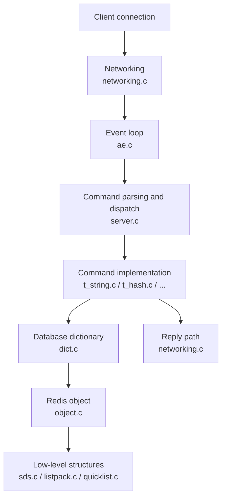
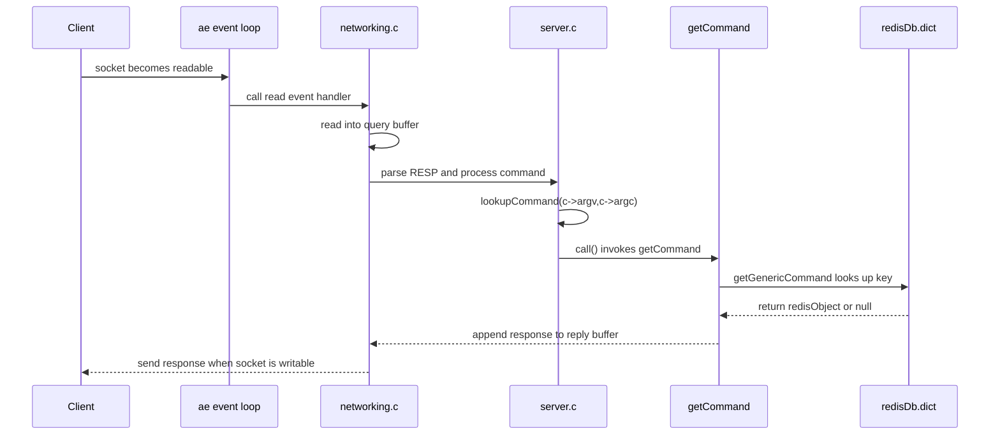
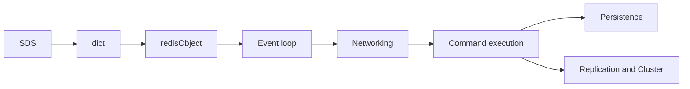

> **This is part 1 of the "Redis Deep Dive" series.**
> This article is based on the **Redis 7.2.14 official source tree**. My local copy is at `F:\MyProjects\goodProjectSourceCodeLearning\redis-7.2.14`.
> The series will use dozens of posts to dissect Redis: SDS, dict, the event loop, networking, command execution, persistence, replication, Sentinel, Cluster, and memory eviction.
> This opening post starts with the most useful question: when a client sends `GET name`, which pieces of Redis source code does it pass through?

## 1. Scope of This Series

Redis is a great project for learning real systems programming. It is not a toy, yet the core is still readable.
Inside it you can study network IO, event loops, data structures, memory management, persistence, replication, and clustering in a production-grade codebase.

Redis changes across versions, so this series starts with a fixed reading baseline:

```text
Redis: 7.2.14
Source: https://download.redis.io/releases/redis-7.2.14.tar.gz
Local: F:\MyProjects\goodProjectSourceCodeLearning\redis-7.2.14
Build VM: Ubuntu 22.04, Linux 5.15, x86_64
Remote path: /home/admin/openSourceCodeLearning/redis-7.2.14
```

The official `README.md` says Redis can be compiled and used on Linux, OSX, OpenBSD, NetBSD, and FreeBSD,
with `make` as the normal build entry. I also built this exact tarball on an Ubuntu VM:

```bash
sudo apt-get update
sudo apt-get install -y build-essential tcl

cd /home/admin/openSourceCodeLearning
tar -xzf redis-7.2.14.tar.gz
cd redis-7.2.14
make -j$(nproc)
```

The build produced:

```text
src/redis-server     16M
src/redis-cli       7.1M
src/redis-benchmark 6.8M
```

Then I ran a minimal smoke test:

```bash
src/redis-server --version
src/redis-cli --version
src/redis-server --port 6380 --daemonize yes --dir /tmp --save "" --appendonly no
src/redis-cli -p 6380 ping
src/redis-cli -p 6380 set name redis-source-reading
src/redis-cli -p 6380 get name
src/redis-cli -p 6380 shutdown nosave
```

Key output:

```text
Redis server v=7.2.14 malloc=jemalloc-5.3.0 bits=64
redis-cli 7.2.14
PONG
OK
redis-source-reading
```

The first startup also printed the common Linux warning that `vm.overcommit_memory` is disabled.
It does not affect this small `PING/SET/GET` check, but it matters for background save, replication, and more complete testing.

I also tried `make test`, but the full test run was still not finished after 10 minutes, so I do not count it as passed here;
the test processes were cleaned up. The rest of this article is based on a source tree that compiles, starts, and handles basic commands.

The series follows two rules:

1. **Explain stable mechanisms first**: SDS, dict, the event loop, and command execution are the skeleton;
2. **Treat concrete function names as source-code anchors**: local details may move between versions, so always verify against the tag you check out.

Unless a later post explicitly switches versions, assume Redis 7.2.14.

## 2. Why Redis Is Fast: Not Just "Single Threaded"

Introductory explanations often say Redis is fast because it is "single threaded". That is only half true and can be misleading.

A better statement is: Redis has historically kept the main command execution path centered around a single-threaded event loop, which avoids a lot of lock contention.
It also keeps data in memory, uses highly tuned data structures, and keeps the path of a single command short and predictable.

Start with this mental picture:



The speed comes from several choices working together:

- Memory access is much faster than disk access;
- The main path avoids heavy locking and thread switching;
- A command table maps command names directly to function pointers;
- Strings, hashes, lists, sets, and sorted sets are tuned for Redis workloads;
- IO, expiration, persistence, and replication are coordinated by the event loop and background work.

So do not stop at the phrase "single threaded". Follow how one request is received, parsed, executed, and written back.

## 3. Where One GET Request Goes: Start With Real Source Locations

Suppose the client sends:

```redis
GET name
```

Start by locating the code instead of guessing from memory:

```bash
cd redis-7.2.14
grep -R "void getCommand" -n src
grep -R "lookupKeyReadOrReply" -n src/t_string.c src/db.c
grep -R "populateCommandTable" -n src/server.c
```

In Redis 7.2.14, the useful anchors are:

| File | Location | Role |
|---|---:|---|
| `src/commands/get.json` | `"function": "getCommand"` | GET metadata: arity, flags, key position |
| `src/server.c` | `populateCommandTable()` | Loads the generated command table into `server.commands` |
| `src/server.c` | `processCommand()` | Looks up, validates, and dispatches commands from `argv/argc` |
| `src/t_string.c` | `getCommand()` | GET command entry point |
| `src/t_string.c` | `getGenericCommand()` | The shared implementation of GET-like reads |
| `src/db.c` | `lookupKeyReadOrReply()` | Looks up a key and writes the null reply if missing |

To Redis, `GET name` is network input first, not just a line of text. The high-level path looks like this:



This path introduces the core building blocks.

## 4. The Event Loop: Redis' Heartbeat

Redis does not create one business thread per client. It maintains an event loop and watches two kinds of events:

- **File events**: a socket is readable or writable;
- **Time events**: periodic work such as expiration checks, statistics, and background scheduling.

The file to read first is `ae.c`. It hides the underlying IO multiplexing mechanism so higher-level code can simply register callbacks.

In simplified pseudocode:

```c
while (!server.shutdown_asap) {
    aeProcessEvents(server.el, AE_ALL_EVENTS);
}
```

The real code is more nuanced, but the main idea is clear: wait for events, call callbacks, then wait again.

That is one reason Redis source code is approachable. You can follow callback paths instead of jumping between many business threads.

## 5. Client Objects: Every Connection Has State

When a TCP connection arrives, Redis creates a client object. It roughly tracks:

- the socket fd;
- the input buffer containing command bytes not fully processed yet;
- parsed command arguments;
- the output buffer waiting to be sent back;
- selected database, authentication state, transaction state, and more.

Redis does not simply "read one line, execute one line".
A client may send multiple commands at once, or one command may arrive in several packets. Redis first buffers the input, then parses complete commands according to the RESP protocol.

Most of this lives in `networking.c`.

## 6. The Command Table: Turning Names Into Function Calls

In Redis 7.2.14, command metadata lives under `src/commands/*.json`.
For `GET`, `src/commands/get.json` says: `arity = 2`, `function = getCommand`,
`command_flags = READONLY, FAST`, and the key is argument 1.

Those JSON files generate a static command table. Then `populateCommandTable()` in `server.c`
loads it into two dictionaries: `server.commands` and `server.orig_commands`.
The second one preserves original command names even if `rename-command` changes the public command table.

So the command table is not an imagined abstraction. Conceptually:

```c
"get" -> getCommand
"set" -> setCommand
"hget" -> hgetCommand
```

The command name from the client is normalized and looked up in this table. Once found, Redis knows:

- which C function implements the command;
- how many arguments it requires;
- whether it is read-only;
- whether it is allowed in special states such as loading, scripting, or cluster mode.

This matters because Redis command execution is not a giant chain of `if else` checks. It is a dispatch system with metadata, validation, and function pointers.
Inside `processCommand()`, Redis calls `lookupCommand(c->argv,c->argc)`, then checks existence, arity, permissions,
cluster state, read-only state, and more before `call()` enters the concrete command function.

Later posts will break down command flags, ACL, key-position analysis, and the execution framework.

## 7. The Database Dictionary: GET Ends at dict

A Redis database can be roughly pictured as two dictionaries:

```text
key -> value
key -> expire time
```

The first stores real data. The second stores expiration timestamps. In Redis 7.2.14, the actual `GET` call chain is short:

```text
getCommand
  -> getGenericCommand
      -> lookupKeyReadOrReply
          -> lookupKeyRead
              -> lookupKey
```

`getGenericCommand()` in `src/t_string.c` does three things:

1. Calls `lookupKeyReadOrReply(c, c->argv[1], shared.null[c->resp])`;
2. If found, validates the value type with `checkType(c, o, OBJ_STRING)`;
3. Writes the value into the reply with `addReplyBulk(c, o)`.

Then `lookupKeyReadOrReply()` in `src/db.c` is only a thin wrapper: it calls `lookupKeyRead()`,
and if no object is returned, it writes the provided null reply. The deeper `lookupKey()` handles expiration,
last-access updates, hit/miss statistics, and related side effects.

Conceptually, executing `GET name` means:

1. Check whether the key is expired and delete it if needed;
2. Look up the value in the database dictionary;
3. Verify that the value is a string;
4. Write the result into the client's output buffer.

This is where several essential low-level structures appear:

- keys are usually SDS values, Redis' own dynamic string type;
- values are wrapped in `redisObject`, which stores type, encoding, reference count, and more;
- the database itself is backed by dict, Redis' own hash table.

That is why part 2 starts with SDS, and dict is a natural next stop after that.

## 8. Source Files to Remember First

Do not try to digest every file on your first pass. Start with this map:

| File | What to understand first |
|---|---|
| `server.c` | Startup, global state, and the main command-processing flow |
| `networking.c` | Client connections, read/write buffers, RESP parsing |
| `ae.c` | Event-loop abstraction, file events, and time events |
| `dict.c` | Hash table used by the database and many internal structures |
| `sds.c` | Dynamic strings used by most string keys |
| `object.c` | Redis object system: type, encoding, reference count |
| `t_string.c` | String commands such as GET, SET, and INCR |
| `expire.c` | Expiration logic |
| `rdb.c` / `aof.c` | RDB and AOF persistence |
| `replication.c` | Replication |
| `cluster.c` | Cluster mode |

Recommended reading order:



Learn the structures before the flows. Otherwise networking and persistence details will bury the main ideas.

## 9. A Tiny Reading Exercise

After this article, do one small source-navigation exercise:

1. Find the implementation of the `GET` command;
2. See how it reads the key argument from the client;
3. See how it looks up the key in the database;
4. Compare the three paths: missing key, wrong type, and found value.

Once you can follow that path, Redis source code stops being a pile of C files and becomes a map you can navigate.

## 10. Recap

- Redis is fast not merely because it is "single threaded", but because memory, the event loop, command dispatch, data structures, and engineering trade-offs work together;
- A `GET` request passes through networking, the event loop, command parsing, command dispatch, the database dictionary, and the reply path;
- A good reading order starts with SDS, dict, and redisObject before moving into networking and persistence;
- This series will build from low-level structures toward command execution, persistence, replication, and clustering.

**Next up**: `SDS`. Why does Redis not just use C strings? How can `sdslen()` be O(1)? What is hidden behind a string pointer?
