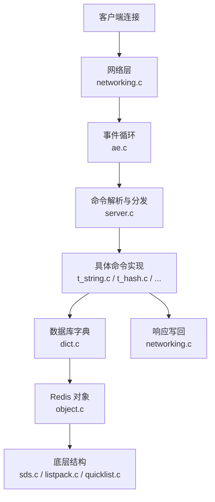
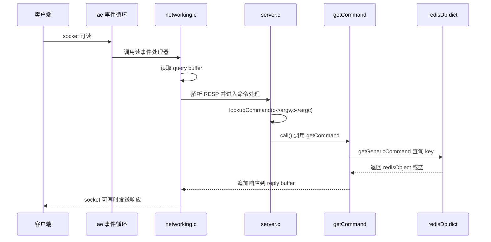
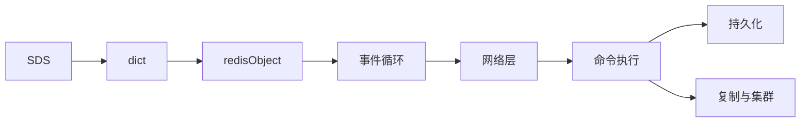

> **这是「Redis 深度解析」系列的第 1 篇。**
> 本文基于 **Redis 7.2.14 官方源码**，本地源码目录为 `F:\MyProjects\goodProjectSourceCodeLearning\redis-7.2.14`。
> 这个系列会用几十篇文章拆 Redis：先建立源码地图，再逐块进入 SDS、dict、事件循环、网络层、命令执行、持久化、复制、哨兵、集群和内存淘汰。
> 本文先回答一个最重要的问题：当客户端发来一条 `GET name`，Redis 内部到底经过了哪些部件？

## 一、先给这个系列定个边界

Redis 的源码很适合学习系统编程：它不是一个玩具项目，但代码组织仍然足够清晰。
你能在里面看到网络 IO、事件循环、数据结构、内存管理、持久化、主从复制、集群协议这些真实系统问题，
而且很多关键路径都能从一个入口一路读到底。

不过 Redis 版本之间会有细节差异。这个系列从一开始就固定一个阅读基准：

```text
Redis: 7.2.14
Source: https://download.redis.io/releases/redis-7.2.14.tar.gz
Local: F:\MyProjects\goodProjectSourceCodeLearning\redis-7.2.14
Build VM: Ubuntu 22.04, Linux 5.15, x86_64
Remote path: /home/admin/openSourceCodeLearning/redis-7.2.14
```

官方 `README.md` 里写得很清楚：Redis 可以在 Linux、OSX、OpenBSD、NetBSD、FreeBSD 上编译使用，
常规构建入口是 `make`。我在一台 Ubuntu 虚拟机上做了实测：

```bash
sudo apt-get update
sudo apt-get install -y build-essential tcl

cd /home/admin/openSourceCodeLearning
tar -xzf redis-7.2.14.tar.gz
cd redis-7.2.14
make -j$(nproc)
```

编译成功后得到这些产物：

```text
src/redis-server     16M
src/redis-cli       7.1M
src/redis-benchmark 6.8M
```

再做一个最小启动验证：

```bash
src/redis-server --version
src/redis-cli --version
src/redis-server --port 6380 --daemonize yes --dir /tmp --save "" --appendonly no
src/redis-cli -p 6380 ping
src/redis-cli -p 6380 set name redis-source-reading
src/redis-cli -p 6380 get name
src/redis-cli -p 6380 shutdown nosave
```

实际输出的关键信息：

```text
Redis server v=7.2.14 malloc=jemalloc-5.3.0 bits=64
redis-cli 7.2.14
PONG
OK
redis-source-reading
```

启动时还出现了一个真实环境里经常遇到的警告：`vm.overcommit_memory` 未开启。
这不影响这次 `PING/SET/GET` 验证，但如果要做后台保存、复制或更完整测试，应该按提示配置内核参数。

我也尝试过 `make test`，但完整测试超过 10 分钟仍未结束，因此没有把它算作“通过”结论；
测试进程已清理。本文接下来基于“源码可编译、二进制可启动、基础命令可运行”的状态继续读源码，
避免把“我猜源码是这样”写成“源码就是这样”。

这个系列后续会遵守两个原则：

1. **讲稳定的核心机制**：比如 SDS、dict、事件循环、命令执行模型，这些是理解 Redis 的骨架；
2. **具体函数名以源码为准**：不同版本的局部实现可能改名或拆分，读的时候要以你 checkout 的 tag 为准。

后续如果切换 Redis 版本，会在文章开头明确说明；没有说明时，都默认沿用 Redis 7.2.14。

## 二、Redis 为什么快：不是一句“单线程”能解释

很多入门文章会说 Redis 快是因为“单线程”。这句话只对了一半，甚至容易误导。

更准确的说法是：Redis 的**命令执行主路径**长期以单线程事件循环为核心，避免了大量锁竞争；
同时它把数据放在内存里，使用高度定制的数据结构，并尽量让一次命令的处理路径短而可预测。

可以先用一张图建立直觉：



这里的“快”，来自几件事叠加：

- 内存访问比磁盘访问快得多；
- 主执行路径减少了锁和线程切换；
- 命令表把命令名直接映射到函数指针；
- 字符串、哈希、列表、集合等结构都为 Redis 的访问模式做了优化；
- IO、过期删除、持久化、复制等任务被事件循环和后台线程协同调度。

所以源码阅读不能只盯着“单线程”四个字，而要看一次请求如何被接住、解析、执行、回写。

## 三、一次 GET 请求走过哪里：先定位真实源码

假设客户端发送：

```redis
GET name
```

先用几个命令定位，而不是凭印象写：

```bash
cd redis-7.2.14
grep -R "void getCommand" -n src
grep -R "lookupKeyReadOrReply" -n src/t_string.c src/db.c
grep -R "populateCommandTable" -n src/server.c
```

在 Redis 7.2.14 里，能看到几处关键位置：

| 文件 | 位置 | 作用 |
|---|---:|---|
| `src/commands/get.json` | `"function": "getCommand"` | GET 命令元数据，声明 arity、flags、key 位置 |
| `src/server.c` | `populateCommandTable()` | 把自动生成的命令表装进 `server.commands` |
| `src/server.c` | `processCommand()` | 基于 `argv/argc` 查命令、校验、调用 `call()` |
| `src/t_string.c` | `getCommand()` | GET 命令入口 |
| `src/t_string.c` | `getGenericCommand()` | 真正执行 GET 的通用逻辑 |
| `src/db.c` | `lookupKeyReadOrReply()` | 查 key，查不到就直接写空响应 |

从 Redis 视角看，`GET name` 不是一行“字符串命令”这么简单，而是一段网络输入。大致路径如下：



把这条链路拆开看，会遇到几个核心概念。

## 四、事件循环：Redis 的心跳

Redis 不会为每个客户端创建一个业务线程。它维护一个事件循环，关心两类事情：

- **文件事件**：socket 可读、socket 可写；
- **时间事件**：周期任务，比如过期检查、统计刷新、后台任务调度。

源码里可以重点看 `ae.c`。它屏蔽了底层 IO 多路复用机制，让上层只需要注册“这个 fd 可读时调用哪个函数”。

简化成伪代码就是：

```c
while (!server.shutdown_asap) {
    aeProcessEvents(server.el, AE_ALL_EVENTS);
}
```

真实代码当然复杂得多，但主线就是：等事件发生，调用回调函数，处理完继续等下一个事件。

这也是 Redis 源码好读的原因之一：你可以顺着“事件回调”一路往下追，而不是在很多线程之间跳来跳去。

## 五、客户端对象：每个连接都有状态

一个 TCP 连接进来后，Redis 会创建客户端对象。它大致记录这些信息：

- socket fd；
- 输入缓冲区，也就是还没处理完的命令内容；
- 当前解析出来的参数数组；
- 输出缓冲区，也就是准备发回给客户端的响应；
- 当前连接所属数据库、认证状态、事务状态等。

所以 Redis 处理命令不是“读一行，执行一行”这么粗糙。
客户端可能一次发来多条命令，也可能一条命令分多次到达。Redis 必须把输入先放进缓冲区，
再按 RESP 协议慢慢解析出完整命令。

这部分主要在 `networking.c`。

## 六、命令表：命令名如何变成函数调用

Redis 7.2.14 的命令元数据来自 `src/commands/*.json`。比如 `src/commands/get.json` 里，
`GET` 的核心信息是：`arity = 2`、`function = getCommand`、`command_flags = READONLY, FAST`，
key 位置是第 1 个参数。

这些 JSON 会生成静态命令表，`server.c` 里的 `populateCommandTable()` 再把它装入两个字典：
`server.commands` 和 `server.orig_commands`。后者用于保留原始命令名，避免 `rename-command` 后内部重写找不到原始命令。

所以命令表不是一个虚构的概念。你可以把它理解成：

```c
"get" -> getCommand
"set" -> setCommand
"hget" -> hgetCommand
```

客户端发来的命令名会被转成小写，然后去命令表里查。查到后，Redis 就知道：

- 这个命令对应哪个 C 函数；
- 至少需要几个参数；
- 命令是否只读；
- 是否允许在某些特殊状态下执行，比如 loading、script、cluster 等。

这一步很关键，因为 Redis 的命令执行不是一堆 `if else`，而是一套可注册、可检查、可分发的命令系统。
在 `processCommand()` 中，Redis 会调用 `lookupCommand(c->argv,c->argc)` 找到命令结构，
再做存在性、参数数量、权限、集群状态、只读状态等检查，最后通过 `call()` 进入具体命令函数。

后面讲命令执行框架时，我们会专门拆命令表、ACL、命令 flags、key 位置分析这些细节。

## 七、数据库字典：GET 最终查的是 dict

Redis 的一个数据库可以粗略理解成两个核心字典：

```text
key -> value
key -> expire time
```

第一个字典存真正的数据，第二个字典存过期时间。执行 `GET name` 时，Redis 7.2.14 的真实函数链路非常短：

```text
getCommand
  -> getGenericCommand
      -> lookupKeyReadOrReply
          -> lookupKeyRead
              -> lookupKey
```

`getGenericCommand()` 在 `src/t_string.c` 里做三件事：

1. 调 `lookupKeyReadOrReply(c, c->argv[1], shared.null[c->resp])` 查 key；
2. 查到后用 `checkType(c, o, OBJ_STRING)` 校验类型；
3. 通过 `addReplyBulk(c, o)` 把 value 写入回复。

继续往下看，`lookupKeyReadOrReply()` 在 `src/db.c` 里只是薄薄包了一层：调用 `lookupKeyRead()`，
如果返回空对象，就向客户端写入传进来的空响应。真正处理过期、访问时间、命中/未命中统计的是更底层的 `lookupKey()`。

所以概念上，Redis 要做的事是：

1. 检查 key 是否过期，必要时删除；
2. 在数据库字典里按 key 查找 value；
3. 检查 value 类型是不是 string；
4. 把结果写进客户端输出缓冲区。

这里会遇到 Redis 最重要的几个底层结构：

- key 通常是 SDS，也就是 Redis 自己实现的动态字符串；
- value 通常包在 `redisObject` 里，里面记录类型、编码、引用计数等信息；
- 数据库本体是 dict，也就是 Redis 自己实现的哈希表。

这就是为什么本系列第二篇会先讲 SDS，第三篇很适合接着讲 dict。

## 八、先记住这些源码入口

第一次读 Redis 源码，不要从所有文件一起啃。先记住下面这张地图：

| 文件 | 先理解什么 |
|---|---|
| `server.c` | Redis 启动、全局状态、命令处理主流程 |
| `networking.c` | 客户端连接、读写缓冲区、RESP 协议解析 |
| `ae.c` | 事件循环抽象，文件事件和时间事件 |
| `dict.c` | 哈希表，数据库和很多内部结构都依赖它 |
| `sds.c` | 动态字符串，几乎所有字符串 key 都会用到 |
| `object.c` | Redis 对象系统，类型、编码、引用计数 |
| `t_string.c` | 字符串命令，比如 GET、SET、INCR |
| `expire.c` | 过期删除逻辑 |
| `rdb.c` / `aof.c` | RDB 和 AOF 持久化 |
| `replication.c` | 主从复制 |
| `cluster.c` | 集群模式 |

源码阅读的顺序建议是：



先学结构，再读流程。否则一开始就钻网络层和持久化，很容易被细节淹没。

## 九、一个最小阅读练习

读完本文后，你可以先不急着编译 Redis，只做一个源码定位练习：

1. 找到 `GET` 命令对应的实现函数；
2. 看它如何从客户端参数里取 key；
3. 看它如何查数据库；
4. 看查不到、类型不对、查到了三种情况分别怎么返回。

如果你能把这条线走通，Redis 源码就不再是一堆陌生的 C 文件，而是一张能导航的地图。

## 十、小结

- Redis 快，不只是因为“单线程”，而是内存、事件循环、命令表、数据结构和工程取舍共同作用；
- 一次 `GET` 请求会经过网络层、事件循环、命令解析、命令分发、数据库字典和响应写回；
- 后续源码阅读建议从 SDS、dict、redisObject 这些基础结构开始；
- 本系列会先把底层结构讲透，再进入网络、命令、持久化、复制和集群。

**下一篇**：`SDS`。Redis 为什么不直接使用 C 字符串？`sdslen()` 为什么能做到 O(1)？一个字符串指针背后到底藏了什么？
