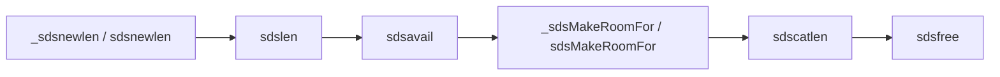

> **This is part 2 of the "Redis Deep Dive" series.**
> In the previous post, we used a `GET` request to build a source-code map of Redis.
> Now we zoom into the first foundational structure: SDS, Redis' Simple Dynamic String.
> This article is based on the **Redis 7.2.14 official source tree**, especially `src/sds.h` and `src/sds.c`.

## 1. Why Start With SDS

Redis is a key-value database, and keys are most often strings.
If the string representation is unclear, dict, objects, and command execution will all feel blurry later.

SDS stands for Simple Dynamic String. In Redis 7.2.14, the entry points are clear:

```text
src/sds.h  -> type definitions, header layout, inline helpers such as sdslen/sdsavail
src/sds.c  -> creation, growth, concatenation, freeing
```

When building on the Ubuntu VM with `make -j$(nproc)`, the Redis source files are compiled one by one.
The build output includes:

```text
CC sds.o
CC t_string.o
CC db.o
CC networking.o
LINK redis-server
LINK redis-cli
```

After the build, `src/redis-server --version` reports `7.2.14`, and a 6380-port smoke test passed
`PING/SET/GET`. So the SDS code below is not an isolated file; it is part of a source tree that was compiled and actually run.

It solves several practical problems of C strings:

- `strlen()` scans until `\0`, so length lookup is O(n);
- C strings use `\0` as the terminator, which is awkward for binary data;
- concatenation can write past the allocated buffer if the caller is wrong;
- exact reallocation on every growth would make frequent appends expensive.

Redis does not ask every caller to handle these problems carefully. It packages them into SDS.

## 2. What Is Wrong With Plain C Strings

A normal C string looks like this:

```c
char *s = "redis";
```

In memory:

```text
r e d i s \0
```

It is lightweight, but the trade-offs are obvious.

### 2.1 Length Requires a Scan

`strlen(s)` does not know the length. It must start at `s[0]` and search for `\0`.

```c
size_t len = strlen(s); // O(n)
```

If Redis had to scan a key every time it needed its length, hot paths would waste work.

### 2.2 Binary Data Is Not Natural

If the content itself contains `\0`, C string functions stop early.

```text
a b \0 c d \0
```

You may want to store 5 bytes, but C string functions will see only 2.
Redis values may contain serialized objects, compressed data, or arbitrary bytes, so it needs binary safety.

### 2.3 Concatenation Is Easy to Get Wrong

Functions such as `strcat` assume enough space already exists. If not, writes may go out of bounds.
In system software, that is not a tiny bug. It is a stability and security issue.

## 3. The Core Idea: Hide a Header Before the Pointer

To callers, an SDS still behaves like `char *`. That is the clever part.

The pointer returned to the caller points at the actual byte buffer:

```text
             s returned to the caller
                    |
                    v
+--------+----------+-------------------+----+
| header | flags    | buf               | \0 |
+--------+----------+-------------------+----+
```

But before `buf`, Redis stores a header. In `src/sds.h`, the public type is literally:

```c
typedef char *sds;
```

So externally SDS is still `char *`. The hidden header contains:

- `len`: used length;
- `alloc`: allocated capacity;
- `flags`: header type.

So `sdslen(s)` does not scan the bytes. It reads the flags byte at `s[-1]`,
determines the header type, walks back from `s`, and reads `len`.

That is the key design: **externally compatible with C strings, internally backed by metadata**.

## 4. Why There Are Multiple Headers

If every string used 64-bit fields for length and capacity, small strings would waste memory.
Redis keys are often short: `user:1:name`, `cart:10086`, and so on.

SDS chooses different header sizes according to the string length:

| Header type | Suitable range | Purpose |
|---|---|---|
| `sdshdr5` | Tiny strings | Stores length in the upper 5 bits of flags; the source comment says the struct itself is not really used |
| `sdshdr8` | Short strings | Store length and capacity in 8-bit fields |
| `sdshdr16` | Medium strings | Use 16-bit fields |
| `sdshdr32` | Large strings | Use 32-bit fields |
| `sdshdr64` | Very large strings | Use 64-bit fields |

A simplified shape:

```c
struct sdshdr8 {
    uint8_t len;
    uint8_t alloc;
    unsigned char flags;
    char buf[];
};
```

The real source uses `__attribute__ ((__packed__))` on these structs to avoid compiler padding.
One detail matters: the `sds.h` comment says `sdshdr5 is never used`; it documents the layout,
while type-5 length is read directly from the flags byte.

## 5. How O(1) Length Lookup Works

Plain C string:

```c
strlen("redis"); // scan from r to \0
```

Redis 7.2.14 SDS:

```c
sdslen(s); // read header.len directly
```

Conceptually:

```c
size_t sdslen(const sds s) {
    header = get_header_before(s);
    return header->len;
}
```

The real implementation is in `src/sds.h`: `sdslen()` is `static inline`.
It reads `s[-1]`, switches on `SDS_TYPE_MASK`, then returns the corresponding header's `len`.

The complexity changes from O(n) to O(1). This matters because Redis repeatedly reads key length, value length, and protocol argument length on hot paths.

## 6. Binary Safety Comes From "Length First"

SDS still keeps a trailing `\0`, so it can interoperate with some C string APIs.
But SDS does not use `\0` to decide content length. It uses `len` in the header.

This is a valid SDS payload:

```text
a b \0 c d
```

If `len = 5`, Redis knows the string has 5 bytes, not 2.

That is what binary safety means: the content can contain arbitrary bytes, and the string library will not stop just because a zero byte appears in the middle.

## 7. Growth Strategy: Fewer Allocations

If every single-byte append caused a new allocation, performance would suffer.
SDS reserves extra free space when it grows, making future appends cheaper.

Conceptually:

```text
len   = used length
alloc = total capacity
free  = alloc - len
```

When code appends:

```c
s = sdscat(s, " world");
```

SDS checks available space:

- If there is enough, write directly;
- If not, reallocate and reserve extra room.

In Redis 7.2.14, the public `sdsMakeRoomFor()` is a thin wrapper; the real logic is in `_sdsMakeRoomFor()`:

- first call `sdsavail(s)` and return immediately if there is enough free space;
- otherwise compute `len + addlen`;
- in greedy mode, double the capacity while the new length is below `SDS_MAX_PREALLOC`;
- after that threshold, add `SDS_MAX_PREALLOC` extra bytes;
- if the header type changes, allocate a new block, copy the bytes, and free the old header instead of using `realloc`.

This trades a little extra memory for fewer `malloc/realloc` calls, which is ideal for Redis' frequent string operations.

## 8. Why Keep the Trailing \0

If SDS already has `len`, why keep the C string terminator?

Compatibility.

Many C library functions, system APIs, and debug helpers expect `char *`.
Because an SDS pointer points directly at `buf` and the buffer ends with `\0`, it can be treated as a C string when the content itself has no embedded zero bytes.

It is a neat engineering compromise:

- Need length? Read the header;
- Need to talk to C APIs? Pass it as `char *`;
- Need binary data? Trust `len`, not `\0`.

## 9. Where SDS Appears in Redis

You will see SDS in many places:

- key names;
- client input buffers;
- AOF buffers;
- command arguments;
- some string values;
- logs and temporary string building.

But Redis values are not always stored directly as SDS.
Redis also has an object system and encoding strategies. The same logical type may use different encodings depending on size and shape.
Small integers may be encoded as integers, and compact structures may use listpack. We will unpack this when we reach `redisObject`.

## 10. Functions to Read First

On your first pass through `sds.c`, focus on these functions before diving into every macro:

| Function | What to look for |
|---|---|
| `_sdsnewlen` / `sdsnewlen` | How SDS is created, how the header type is selected, and how `len/alloc/flags` are initialized |
| `sdslen` | The inline helper in `src/sds.h`; how length lookup stays O(1) |
| `sdsavail` | How remaining capacity is read |
| `_sdsMakeRoomFor` / `sdsMakeRoomFor` | Where growth strategy happens and how greedy preallocation works |
| `sdscatlen` | How append ensures enough space |
| `sdsfree` | Why freeing must use `sdsHdrSize(s[-1])` to locate the true header start |

Suggested reading order:



Understand the lifecycle first: create, read length, check capacity, grow, append, free.

## 11. Recap

- C strings are lightweight, but length lookup, binary safety, and growth safety are poor fits for Redis hot paths;
- SDS is externally `char *`, but hides a header before `buf`, storing `len`, `alloc`, and `flags`;
- `sdslen()` is O(1) because it reads the header instead of scanning bytes;
- SDS still keeps a trailing `\0`, so it remains compatible with C strings in suitable cases;
- Multiple header types reduce memory waste for small strings; `sdshdr5` should be read according to the source comment, with length encoded directly in the flags byte.

**Next up** can be `dict`: why is a Redis database essentially a hash table, and how does incremental rehash avoid long pauses?
