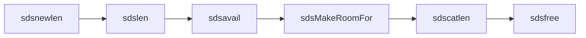

> **这是「Redis 深度解析」系列的第 2 篇。**
> 上一篇我们用一次 `GET` 请求建立了 Redis 源码全景。
> 这一篇正式下钻第一个基础结构：SDS，也就是 Redis 自己实现的动态字符串。

## 一、为什么先讲 SDS

Redis 是一个键值数据库，而 key 最常见的形态就是字符串。
如果字符串这个基础结构不清楚，后面读 dict、对象系统、命令执行都会卡住。

SDS 的名字来自 Simple Dynamic String。它解决的是 C 字符串在系统软件里几个非常现实的问题：

- `strlen()` 要从头扫到 `\0`，长度计算是 O(n)；
- C 字符串以 `\0` 作为结束标记，天然不适合保存二进制数据；
- 拼接字符串时容易写越界；
- 每次增长都精确分配，频繁扩容会带来很多内存分配开销。

Redis 没有把这些问题交给调用方小心处理，而是把它们封进了 SDS。

## 二、C 字符串的问题到底在哪里

一个普通 C 字符串长这样：

```c
char *s = "redis";
```

内存里是：

```text
r e d i s \0
```

这很轻量，但问题也明显。

### 2.1 取长度需要遍历

`strlen(s)` 不知道长度，只能从 `s[0]` 开始一直找 `\0`。

```c
size_t len = strlen(s); // O(n)
```

如果 Redis 每次处理 key 都这样扫一遍，热点路径会很浪费。

### 2.2 不能自然保存二进制

如果内容中间本来就有 `\0`，C 字符串函数会提前停下。

```text
a b \0 c d \0
```

你想保存 5 个字节，但 C 字符串函数会认为它只有 2 个字节。
Redis 的 value 可能是图片片段、序列化后的对象、压缩数据，所以它需要二进制安全。

### 2.3 拼接容易出错

`strcat` 这类函数默认你已经准备好了足够的空间。空间不够就可能写越界。
系统软件里，这不是“小 bug”，而是安全和稳定性问题。

## 三、SDS 的核心思路：指针前面藏 header

SDS 对外仍然表现得像 `char *`。这点非常巧妙。

调用方拿到的指针指向真正的字符数组：

```text
             返回给调用方的 s
                    |
                    v
+--------+----------+-------------------+----+
| header | flags    | buf               | \0 |
+--------+----------+-------------------+----+
```

但在 `buf` 前面，Redis 额外放了 header。header 里记录：

- `len`：当前字符串已使用长度；
- `alloc`：当前分配的容量；
- `flags`：header 类型。

所以 `sdslen(s)` 不需要扫描字符串，只要从 `s` 往前找到 header，读出 `len`。

这就是 SDS 最重要的设计：**对外像 C 字符串，对内有自己的元数据**。

## 四、为什么有多种 header

如果每个字符串都用 64 位字段保存长度和容量，小字符串会浪费很多内存。
Redis 的 key 往往非常短，比如 `user:1:name`、`cart:10086`。

所以 SDS 按字符串长度选择不同 header，大致包括：

| header 类型 | 适合的长度范围 | 目的 |
|---|---|---|
| `sdshdr5` | 极短字符串 | 尽量压缩 header 开销 |
| `sdshdr8` | 较短字符串 | 用 8 位字段保存长度和容量 |
| `sdshdr16` | 中等字符串 | 用 16 位字段 |
| `sdshdr32` | 大字符串 | 用 32 位字段 |
| `sdshdr64` | 超大字符串 | 用 64 位字段 |

简化理解：

```c
struct sdshdr8 {
    uint8_t len;
    uint8_t alloc;
    unsigned char flags;
    char buf[];
};
```

真实源码里会用紧凑布局，避免编译器插入额外 padding。这个细节说明 Redis 对内存密度非常敏感。

## 五、O(1) 取长度是怎么做到的

普通 C 字符串：

```c
strlen("redis"); // 从 r 扫到 \0
```

SDS：

```c
sdslen(s); // 直接读 header.len
```

概念上可以理解成：

```c
size_t sdslen(const sds s) {
    header = get_header_before(s);
    return header->len;
}
```

复杂度从 O(n) 变成 O(1)。这在 Redis 里非常重要，因为 key 长度、value 长度、协议参数长度会在很多路径上被反复读取。

## 六、二进制安全来自“长度优先”

SDS 仍然会在末尾保留一个 `\0`，这样它可以兼容部分 C 字符串函数。
但 SDS 判断内容长度时不依赖 `\0`，而是依赖 header 里的 `len`。

也就是说，这段内容是合法 SDS：

```text
a b \0 c d
```

只要 `len = 5`，Redis 就知道它有 5 个字节，而不是 2 个。

这就是“二进制安全”的含义：内容可以包含任意字节，字符串库不会因为中间出现 `\0` 就误判结束。

## 七、扩容策略：少做内存分配

如果每次追加一个字节都重新分配内存，性能会很差。
SDS 会在扩容时预留一部分空闲空间，让后续追加更便宜。

概念上：

```text
len   = 已使用长度
alloc = 总容量
free  = alloc - len
```

当你执行类似追加操作时：

```c
s = sdscat(s, " world");
```

SDS 会检查剩余空间是否够：

- 如果够，直接写入；
- 如果不够，重新分配，并多预留一些空间。

这种策略用一点额外内存换更少的 `malloc/realloc`，非常适合 Redis 这种高频字符串操作场景。

## 八、为什么 SDS 末尾还要有 \0

既然 SDS 已经有 `len`，为什么还要保留 C 字符串的结束符？

原因是兼容。

很多 C 标准库函数、系统调用、调试输出都习惯接收 `char *`。
SDS 指针直接指向 `buf`，并且末尾有 `\0`，所以在内容本身不包含中间零字节时，它可以很自然地被当成 C 字符串使用。

这是一种很漂亮的工程折中：

- 需要长度时，读 header；
- 需要和 C 生态交互时，把它当 `char *`；
- 需要保存二进制时，以 `len` 为准。

## 九、SDS 在 Redis 里出现在哪里

你会在很多地方看到 SDS：

- key 名称；
- 客户端输入缓冲区；
- AOF 缓冲；
- 命令参数；
- 一部分字符串 value；
- 日志和临时拼接字符串。

但要注意：Redis value 不总是直接用 SDS。
Redis 有对象系统和编码策略，同一个逻辑类型可能根据大小、形态选择不同编码。
比如小整数可能被编码成整数，短结构可能放进 listpack。这个话题后面讲 `redisObject` 时会展开。

## 十、读源码时抓这几个函数

第一次读 `sds.c`，建议先抓这些函数，不要一上来陷进所有宏：

| 函数 | 先看什么 |
|---|---|
| `sdsnewlen` | 如何创建 SDS，如何选择 header 类型 |
| `sdslen` | 如何 O(1) 读取长度 |
| `sdsavail` | 如何读取剩余容量 |
| `sdsMakeRoomFor` | 扩容策略在哪里发生 |
| `sdscatlen` | 追加内容时如何保证空间足够 |
| `sdsfree` | 释放时为什么要找到真正的 header 起点 |

阅读顺序可以是：



先理解生命周期：创建、读长度、看容量、扩容、追加、释放。

## 十一、小结

- C 字符串轻量，但长度计算、二进制安全、扩容安全都不适合 Redis 的核心路径；
- SDS 在 `buf` 前面隐藏 header，保存 `len`、`alloc` 和 `flags`；
- `sdslen()` 能 O(1) 返回长度，因为它读的是 header，不是扫描字符；
- SDS 末尾仍保留 `\0`，所以在合适场景下能兼容 C 字符串；
- 多种 header 类型是为了减少小字符串的内存浪费。

**下一篇**可以继续讲 `dict`：Redis 的数据库为什么本质上是哈希表？渐进式 rehash 是怎么避免一次性卡顿的？
