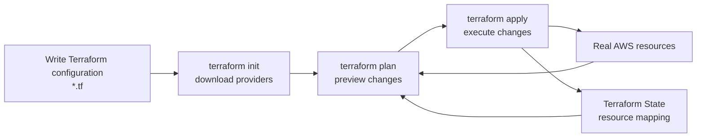
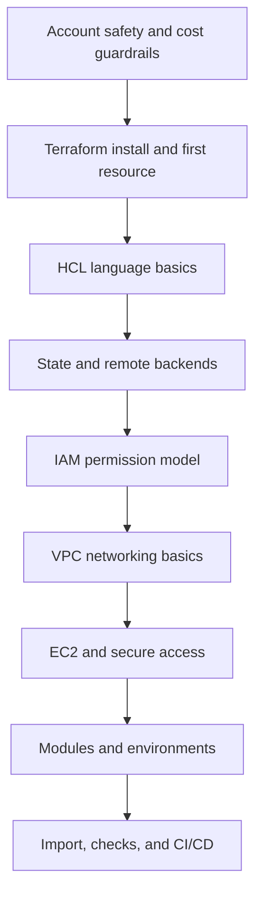

> **This is part 1 of the "Terraform + AWS from Zero to Production" series.**
> The series starts from a beginner's point of view: no assumed Terraform experience, and no assumed deep AWS background.
> We will first cover account safety, cost control, and core concepts, then move into S3, IAM, VPC, EC2, modules, remote state, and CI/CD.

When I first started learning Terraform, the obvious temptation was to install it, write a `.tf` file, and run `terraform apply` as soon as possible.

That temptation makes sense. Terraform feels powerful because a few lines of configuration can create real cloud infrastructure.

But if you have just created a new AWS account, it is worth slowing down first. Cloud work is different from local development: a local mistake usually gives you an error; a cloud mistake can create a bill or expose permissions.

So this opening post does not start with code. It starts with three questions:

1. How do we avoid using the Root user for everyday work?
2. How do we avoid unexpected cost while learning?
3. How do we build a basic Terraform mental model before touching real resources?

Once these are clear, the first Terraform configuration will feel much less mysterious.

## 1. What This Series Is Trying to Solve

Terraform is an Infrastructure as Code tool.

The point is not merely to click fewer buttons in the cloud console. The deeper goal is to make infrastructure:

- **Reproducible**: another machine or another person can create the same environment;
- **Reviewable**: you can inspect what will be created, changed, or destroyed before execution;
- **Versioned**: networks, servers, permissions, and storage can live in Git with application code;
- **Recoverable**: a broken environment can be rebuilt from code and state, not from memory.

These benefits do not appear automatically.

Terraform has its own learning curve, especially around these topics:

- HCL looks simple, but variables, types, expressions, and modules quickly become real design work;
- `terraform.tfstate` is central, and Terraform is hard to understand without understanding state;
- AWS permissions are detailed, and IAM mistakes usually mean either too little access or too much access;
- Cloud resources cost money, so learning must include the habit of creating, verifying, and destroying resources;
- Terraform changes real infrastructure, not a throwaway toy environment.

That is why this series will follow a simple rhythm: set guardrails first, then move forward.

## 2. Add Guardrails to a New AWS Account

If you have just created an AWS account, I recommend finishing the following setup first. Not all of it needs to be managed by Terraform. In fact, the earliest account-safety settings are often better done in the console first.

### 1. Enable MFA for the Root User

When an AWS account is created, it starts with a Root user. This identity has the highest level of access in the account.

You should not use the Root user for daily learning and operations. AWS recommends avoiding Root user access unless a task explicitly requires it, and enabling MFA for the Root user.

My mental model is: the Root user is a vault key, not a daily access badge.

Suggested actions:

- Set a strong password;
- Enable MFA, preferably with a recovery plan instead of depending on only one fragile device;
- Do not create access keys for the Root user;
- Keep account recovery channels such as email and phone number up to date;
- Use IAM Identity Center, IAM roles, or a dedicated IAM user for daily work later.

### 2. Create a Budget Alert

For AWS learning, a budget alert is not decoration. It is a seatbelt.

AWS Budgets can track cost and usage and notify you when thresholds are reached. For a personal learning account, the first budget can be very small, such as 1 USD, 5 USD, or whatever amount you are comfortable spending on experiments.

A budget alert does not prevent all charges, but it gives you an early signal that something may have been left running, exceeded a free tier, or cost more than expected.

Suggested actions:

- Create a monthly cost budget;
- Add several thresholds, such as 50%, 80%, and 100%;
- Send notifications to an email address you actually check;
- Review Billing and Cost Explorer after experiments;
- Build the habit of running `terraform destroy` or manually cleaning up resources.

### 3. Pick a Default Learning Region

AWS has many Regions. While learning, it is easier to choose one default Region and keep your resources there.

I would choose a Region that:

- Has acceptable latency from where I work;
- Supports the common services I want to learn;
- Appears often in documentation and community examples;
- Is easy for me to remember and use consistently.

For example, you might start with a common Region such as `ap-southeast-1`, `ap-northeast-1`, or `us-east-1`. The exact choice depends on your network, service availability, and cost.

In later examples, we will make the Region a variable instead of scattering it through every resource.

## 3. The First Terraform Mental Model

Before looking at syntax, Terraform's workflow can be understood like this:



The diagram has three important pieces.

The first is **configuration**. In `.tf` files, you declare what you want: an S3 bucket, an EC2 instance, a VPC, and so on.

The second is **real infrastructure**. Terraform eventually calls AWS APIs to create, update, or delete those resources.

The third is **state**. Terraform needs to remember how a resource in your code maps to a real object in AWS.

Beginners often focus only on configuration, but state is where Terraform becomes powerful and where many pitfalls live.

## 4. Terraform Is Not Just a Cloud Resource Generator

If you think of Terraform only as a command-line tool that creates cloud resources, it will soon become confusing.

For example:

- Why does Terraform detect a difference if I change a resource manually in the AWS console?
- Why can deleting a block of configuration delete a real cloud resource?
- Why should I not casually delete `.tfstate`?
- Why is local state a problem when multiple people collaborate?
- Why should the same module receive different variables in different environments?

These questions all point to the same core idea: Terraform converges desired state and real state.

Your configuration describes the desired state. Existing AWS resources are the real state. Terraform uses providers and state to compare them, then produces an execution plan.

That is why you should carefully read `terraform plan` before every apply.

`plan` is not a ritual. It is Terraform giving you a chance to review infrastructure change before it happens.

## 5. The Learning Path for This Series

I plan to study and write in this order:



The series will roughly include:

1. Before writing code, protect your new AWS account;
2. What problem does IaC actually solve?
3. First resource: start with an S3 bucket;
4. HCL basics: variables, outputs, and expressions;
5. State: Terraform's most important concept;
6. Remote backend: store state in S3;
7. IAM: run Terraform with least privilege;
8. VPC: build a network from scratch;
9. EC2: create a server with safer access;
10. Modules: from working code to maintainable code;
11. Multiple environments: dev, staging, and prod;
12. Plan review: avoiding accidental destruction;
13. Import: bringing manually created resources under Terraform;
14. Static checks and security scanning;
15. Automating Terraform with GitHub Actions;
16. A complete small project to close the loop.

The goal is not to cram every concept into one post. Each article should answer a few questions, include runnable examples, and clean up resources at the end.

## 6. Starting Without Code Is Intentional

Many tutorials begin with `main.tf`, and that is a valid path. The official Terraform getting-started tutorials also move through installation, resource creation, resource management, and destruction.

For this series, I want to fill in the context a real learner needs:

- I just created an AWS account. What must be configured first?
- How do I keep learning costs under control?
- What is the relationship between Terraform and the AWS console?
- Why should I avoid changing the same resource sometimes by hand and sometimes through Terraform?
- Why does everyone keep saying state matters?

Without those answers, writing Terraform feels like driving through fog.

In the next article, we will install Terraform and the AWS CLI, then use a low-risk resource to walk through:

```bash
terraform init
terraform fmt
terraform validate
terraform plan
terraform apply
terraform destroy
```

The goal of this first article is modest: understand what we are operating before we operate it.

## References

- [Terraform AWS Get Started](https://developer.hashicorp.com/terraform/tutorials/aws-get-started)
- [Terraform Language Documentation](https://developer.hashicorp.com/terraform/language)
- [Terraform State](https://developer.hashicorp.com/terraform/language/state)
- [AWS Root user best practices](https://docs.aws.amazon.com/IAM/latest/UserGuide/root-user-best-practices.html)
- [Creating a budget - AWS Cost Management](https://docs.aws.amazon.com/cost-management/latest/userguide/budgets-create.html)
