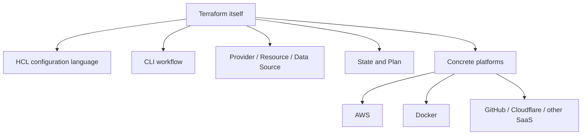
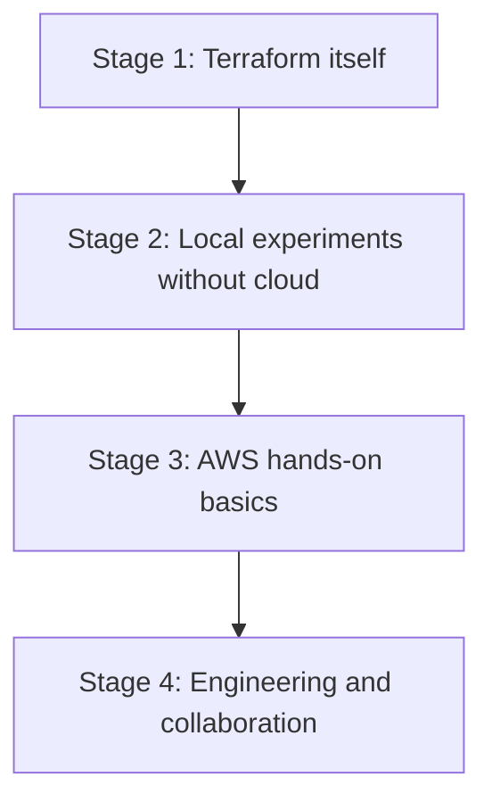

> **This is part 1 of the "Terraform + AWS from Zero to Production" series.**
> AWS will be the main hands-on cloud platform in this series, but an AWS account is not required on day one.
> If you do not have a cloud account yet, you can first learn Terraform concepts locally, then move into AWS after `init`, `plan`, `apply`, `destroy`, providers, resources, and state feel familiar.

My first version of this series started from a newly created AWS account.

That is useful for readers who already have AWS, but it raises the entry barrier for true beginners. Some readers may not have registered AWS yet. Some may not want to bind a credit card immediately. Some may simply worry about cost and permissions.

So this opening post resets the direction:

- Terraform concepts can be learned without AWS;
- AWS is still a good platform for real cloud practice later;
- Official documentation should be part of the learning path from the beginning;
- At every stage, we should know whether we are learning Terraform itself or a specific cloud provider.

In other words, the series is still about **Terraform + AWS**, but the doorway should be friendly to people who do not have an AWS account yet.

## 1. Separate Terraform from AWS First

Terraform is an Infrastructure as Code tool. You describe the desired state of your infrastructure in configuration files, and Terraform uses providers to call platform APIs to create, update, or delete resources.

AWS is only one of many platforms Terraform can manage.

Terraform can manage:

- Cloud resources, such as AWS, Azure, and GCP;
- Local or development resources, such as Docker containers;
- SaaS resources, such as GitHub, Cloudflare, and Datadog;
- Helper resources, such as random strings, TLS materials, and local files.

For beginners, it helps to separate two layers:



If you start with AWS immediately, you meet two knowledge systems at once:

- Terraform concepts;
- AWS concepts such as accounts, Regions, IAM, VPC, billing, and security groups.

That is not wrong, but it is heavier. A gentler path is to run Terraform locally first, understand the core workflow, and then transfer that mental model to AWS.

## 2. How to Read the Official Documentation

When learning Terraform, I recommend using HashiCorp's official documentation as the main map, not just following scattered blog posts.

These are the first pages worth bookmarking:

- [Terraform Tutorials](https://developer.hashicorp.com/terraform/tutorials): the official tutorial hub, with AWS, Docker, GCP, Azure, HCP Terraform, and other tracks;
- [Get Started - Docker](https://developer.hashicorp.com/terraform/tutorials/docker-get-started): a beginner path that does not require a cloud account;
- [Get Started - AWS](https://developer.hashicorp.com/terraform/tutorials/aws-get-started): the official AWS beginner path once you have an AWS account;
- [Terraform Language Documentation](https://developer.hashicorp.com/terraform/language): HCL, variables, outputs, modules, backends, state, and configuration references;
- [Terraform CLI Documentation](https://developer.hashicorp.com/terraform/cli): authoritative docs for commands such as `init`, `plan`, `apply`, and `destroy`;
- [Terraform State](https://developer.hashicorp.com/terraform/language/state): the official entry point for understanding state.

The official tutorials page is useful because it does not treat AWS as the only starting point. Docker, AWS, Azure, GCP, and HCP Terraform are presented as separate getting-started tracks. For readers without an AWS account, the Docker track is a very good first stop.

My suggested order:

1. Read the Tutorials overview to see how the official learning material is organized;
2. Follow the Docker getting-started path first, avoiding cloud cost at the beginning;
3. Keep the CLI and Language documentation open so commands and syntax do not feel like magic copied from a tutorial;
4. Move into AWS after `plan`, `apply`, and state begin to make sense.

## 3. How to Learn Without an AWS Account

If you do not have an AWS account right now, do not get stuck. You still have several good options.

### Path A: Local Docker

This is the best no-cloud beginner path.

You need:

- Terraform installed locally;
- Docker installed locally;
- The Terraform Docker provider to create, change, and destroy a container.

This teaches:

- How `terraform init` downloads providers;
- How `.tf` files describe resources;
- How `terraform plan` previews changes;
- How `terraform apply` creates resources;
- How `terraform destroy` removes resources;
- How state records the mapping between configuration and a real object.

The goal is to learn Terraform fundamentals, not Docker itself.

### Path B: Pure Local Providers

If you do not want to install Docker yet, you can still practice with providers that do not depend on a cloud platform, for example:

- `random`: generate random strings, passwords, and IDs;
- `local`: create local files;
- `tls`: generate local certificate materials.

This path does not simulate a real cloud architecture, but it is useful for understanding providers, resources, outputs, and state.

For example, Terraform can generate a random project suffix and write it into a local file. That is a tiny experiment, but it is enough to observe how state changes.

### Path C: HCP Terraform and Official Interactive Tutorials

HashiCorp also provides interactive tutorials and HCP Terraform material. These are useful for understanding remote execution, remote state, and team collaboration.

For complete beginners, I would still run a few local cycles first:

```bash
terraform init
terraform plan
terraform apply
terraform destroy
```

Once you have felt that loop in your own terminal, remote workflows are easier to understand.

## 4. If You Already Have AWS, Do Not Rush to Apply

If you already have an AWS account, you can move into the AWS hands-on posts later. Before creating resources, add a few guardrails.

At minimum:

- Enable MFA for the Root user;
- Do not create access keys for the Root user;
- Create a low AWS Budgets alert;
- Choose one default learning Region;
- Use a dedicated IAM identity for daily work instead of the Root user;
- Confirm resources are destroyed after each experiment.

AWS recommends avoiding Root user access for daily tasks and enabling MFA. Budget alerts cannot prevent every charge, but they can warn you early when something may have been left running.

I will not expand all of this here. It deserves its own pre-AWS checklist before we start creating AWS resources.

## 5. A Better Outline for This Series

The new outline has four stages: learn Terraform itself, practice without a cloud account, move into AWS, and then engineer the workflow.



### Stage 1: Terraform Itself

1. **You can start without an AWS account**
   - Terraform vs AWS
   - Official documentation entry points
   - No-cloud learning paths
   - Full series outline

2. **What problem does IaC actually solve?**
   - Why console-clicking does not scale
   - Declarative configuration
   - Terraform vs scripts, CloudFormation, and CDK

3. **Install Terraform and run the CLI workflow**
   - Installation options
   - `init / fmt / validate / plan / apply / destroy`
   - `.terraform/` and the lock file

4. **HCL basics: how Terraform configuration is written**
   - Blocks, arguments, expressions
   - Variables, locals, outputs
   - Types, defaults, validation

5. **Provider, Resource, and Data Source**
   - How Terraform connects to external platforms
   - Resources manage objects
   - Data sources query existing information

6. **State: Terraform's most underestimated core**
   - What state records
   - Why state should not be casually deleted
   - Drift, refresh, and import intuition

### Stage 2: Local Experiments Without Cloud

7. **Use Docker for the first real resource**
   - Create a container
   - Change a port or image
   - Observe plan and state
   - Destroy the resource

8. **Use local/random providers for variables and outputs**
   - No cloud account required
   - Generate a random name
   - Write a local file
   - Output useful values

9. **First step into modules**
   - Why modules exist
   - How to design inputs and outputs
   - When not to abstract too early

### Stage 3: AWS Hands-On Basics

10. **Account safety and cost guardrails before AWS**
    - Root MFA
    - Budgets
    - Region
    - IAM identity preparation

11. **First AWS resource: start with an S3 bucket**
    - AWS provider
    - Low-risk resource
    - Create, change, destroy

12. **Manage IAM with Terraform without locking yourself out**
    - IAM users, roles, policies
    - Least privilege
    - Prefer temporary credentials

13. **Build a VPC from scratch**
    - VPC, subnets, route tables, internet gateway
    - Public and private subnets
    - CIDR planning

14. **Create an EC2 instance with safer access**
    - AMI, instance type, security group
    - SSH and SSM Session Manager
    - Minimal security group exposure

### Stage 4: Engineering and Collaboration

15. **Remote state and collaboration**
    - Problems with local state
    - S3 backend or HCP Terraform
    - State locking

16. **Multiple environments**
    - dev, staging, prod
    - Workspace boundaries
    - Directory isolation and variable files

17. **Change review: learn to read plan carefully**
    - Create, Update, Replace, Destroy
    - `lifecycle`
    - Preventing accidental destruction

18. **Import: bring manual resources under Terraform**
    - Why legacy resources exist
    - Basic import workflow
    - Completing configuration after import

19. **Formatting, validation, and static checks**
    - `fmt`, `validate`
    - tflint
    - checkov / tfsec

20. **Automate Terraform with GitHub Actions**
    - Run plan on pull requests
    - Apply from main
    - OIDC vs long-lived secrets

21. **A complete small project**
    - VPC + S3 + IAM + EC2
    - README and destroy workflow
    - Cost review

This outline is longer than the first version, but the entry is gentler. Readers without AWS can follow the first nine posts. Readers with AWS should still benefit from the fundamentals before entering cloud practice.

## 6. What to Do After This Post

If you are starting from zero, do not register AWS immediately just because the series title mentions AWS. Do three smaller things first:

1. Open [Terraform Tutorials](https://developer.hashicorp.com/terraform/tutorials) and look at the official tutorial map;
2. Open [Get Started - Docker](https://developer.hashicorp.com/terraform/tutorials/docker-get-started) and confirm that you can start without a cloud account;
3. Prepare Terraform and Docker locally so we can run the first local experiment in the next post.

If you already have AWS, do not rush to create resources. Prepare Root MFA, a budget alert, and a default Region first. The earlier you build that habit, the less stressful cloud learning becomes.

The principle for the rest of the series is simple: **explain Terraform first, then explain platform-specific details; build confidence with low-risk experiments, then move into real cloud resources.**

## References

- [Terraform Tutorials](https://developer.hashicorp.com/terraform/tutorials)
- [Get Started - Docker](https://developer.hashicorp.com/terraform/tutorials/docker-get-started)
- [Get Started - AWS](https://developer.hashicorp.com/terraform/tutorials/aws-get-started)
- [Terraform Language Documentation](https://developer.hashicorp.com/terraform/language)
- [Terraform CLI Documentation](https://developer.hashicorp.com/terraform/cli)
- [Terraform State](https://developer.hashicorp.com/terraform/language/state)
- [AWS Root user best practices](https://docs.aws.amazon.com/IAM/latest/UserGuide/root-user-best-practices.html)
- [Creating a budget - AWS Cost Management](https://docs.aws.amazon.com/cost-management/latest/userguide/budgets-create.html)