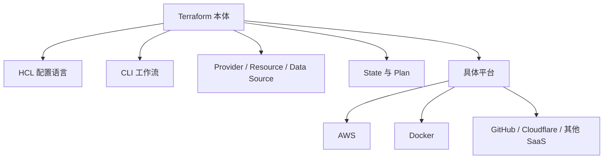
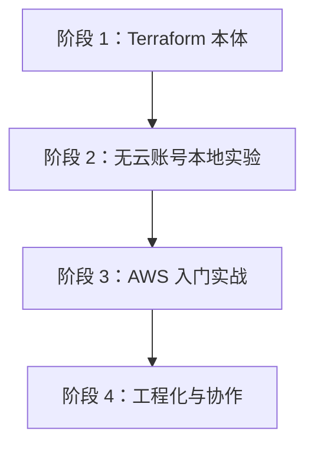

> **这是《Terraform + AWS 从零到工程化》系列的第 1 篇。**
> 这个系列会用 AWS 做主要实战平台，但不会假设每个读者一开始都有 AWS 账号。
> 如果你还没有注册云账号，也可以先跟着本地实验学习 Terraform 的核心概念，等理解了 `init`、`plan`、`apply`、`destroy`、provider、resource、state 之后，再进入 AWS。

我最初写这个系列大纲时，把“刚创建 AWS 账号”放在了第一篇的中心。

这个方向对已经有 AWS 账号的人很实用，但它有一个问题：很多真正的 Terraform 小白，可能还没注册 AWS，或者暂时不想绑定信用卡、担心费用、担心权限配置。对这些人来说，如果第一步就是 AWS，门槛会显得有点硬。

所以这篇重新调整一下思路：

- Terraform 的核心概念，可以先不用 AWS 学；
- AWS 很适合做后续真实云环境实战；
- 官方文档要从一开始就放在学习路线里；
- 每个阶段都要知道“我到底在学 Terraform，还是在学某个云厂商”。

换句话说，这个系列的主线仍然是 **Terraform + AWS**，但入口应该对没有 AWS 账号的人也友好。

## 一、先把 Terraform 和 AWS 分开看

Terraform 是一个 Infrastructure as Code 工具。它用配置文件描述你想要的基础设施状态，然后通过 provider 调用不同平台的 API 去创建、修改或删除资源。

AWS 只是 Terraform 可以管理的众多平台之一。

Terraform 可以管理：

- 云平台资源，例如 AWS、Azure、GCP；
- 本地或开发环境资源，例如 Docker 容器；
- SaaS 平台资源，例如 GitHub、Cloudflare、Datadog；
- 一些辅助资源，例如随机字符串、TLS 证书、本地文件。

所以，小白学习 Terraform 时要先分清两层：

如果一上来就用 AWS，初学者会同时遇到两套知识：

- Terraform 自己的概念；
- AWS 的账号、区域、IAM、VPC、计费、安全组等概念。

这不是不行，但会让学习负担变大。更温和的方式是：先用本地或低风险环境把 Terraform 本体跑通，再把同一套思维迁移到 AWS。

## 二、官方文档应该怎么读

学习 Terraform 时，我建议把 HashiCorp 官方文档当成主线，而不是只看零散教程。

最值得先收藏的几个入口：

- [Terraform Tutorials](https://developer.hashicorp.com/terraform/tutorials)：官方教程总入口，包含 AWS、Docker、GCP、Azure、HCP Terraform 等入门路径；
- [Get Started - Docker](https://developer.hashicorp.com/terraform/tutorials/docker-get-started)：没有云账号也能做的入门路线，用 Docker 学 Terraform 的基础工作流；
- [Get Started - AWS](https://developer.hashicorp.com/terraform/tutorials/aws-get-started)：有 AWS 账号后可以跟的官方 AWS 入门路线；
- [Terraform Language Documentation](https://developer.hashicorp.com/terraform/language)：HCL、变量、输出、模块、backend、state 等语言和配置文档；
- [Terraform CLI Documentation](https://developer.hashicorp.com/terraform/cli)：`init`、`plan`、`apply`、`destroy` 等命令的权威说明；
- [Terraform State](https://developer.hashicorp.com/terraform/language/state)：理解 state 的官方入口。

官方教程页很适合作为地图。它不是只提供 AWS 路线，而是把 Docker、AWS、Azure、GCP、HCP Terraform 等路径并列列出来。对没有 AWS 账号的人来说，Docker 路线尤其适合作为第一站。

我的建议是：

1. 先读 Tutorials 总入口，知道 Terraform 官方把学习内容分成哪些块；
2. 再走 Docker 入门路线，先不碰云费用；
3. 同时查 CLI 和 Language 文档，不要把命令和语法只当成“教程里复制来的东西”；
4. 等 `plan`、`apply`、`state` 有感觉后，再进入 AWS。

## 三、没有 AWS 账号，怎么学

如果你现在没有 AWS 账号，不用卡住。可以按下面三条路线学习。

### 路线 A：Docker 本地路线

这是最推荐的无云账号入门方式。

你只需要：

- 本机安装 Terraform；
- 本机安装 Docker；
- 使用 Terraform Docker provider 创建、修改、销毁一个容器。

这条路线能学到：

- `terraform init` 如何下载 provider；
- `.tf` 配置文件如何描述资源；
- `terraform plan` 如何预览变更；
- `terraform apply` 如何创建资源；
- `terraform destroy` 如何销毁资源；
- state 如何记录容器和配置的对应关系。

它学的是 Terraform 的基本功，不是 Docker 本身。

### 路线 B：纯本地 provider 路线

如果你暂时连 Docker 都不想装，也可以用一些不依赖云平台的 provider 做概念练习，例如：

- `random` provider：生成随机字符串、密码、ID；
- `local` provider：创建本地文件；
- `tls` provider：生成本地证书材料。

这条路线不适合模拟真实云架构，但很适合理解 provider、resource、output、state。

例如，你可以用 Terraform 生成一个随机项目后缀，再写入本地文件。这个实验很小，但足够观察 state 的变化。

### 路线 C：HCP Terraform / 官方在线实验

HashiCorp 官方也提供一些交互式教程和 HCP Terraform 相关内容。它们适合用来理解远程执行、远程 state、团队协作等概念。

不过对完全零基础的人，我还是建议先在本地跑几次 `init -> plan -> apply -> destroy`。手上真正执行过一轮，再看远程协作会更容易。

## 四、有 AWS 账号，先别急着 apply

如果你已经有 AWS 账号，可以直接进入后续 AWS 实战。但在那之前，建议先做账号护栏。

最少完成这几件事：

- Root 用户开启 MFA；
- 不给 Root 用户创建 Access Key；
- 设置一个很低的 AWS Budgets 预算告警；
- 固定一个默认学习 Region；
- 日常操作使用专门的 IAM 身份，而不是 Root 用户；
- 每次实验结束都确认资源是否销毁。

AWS 官方也建议不要把 Root 用户作为日常操作身份，并建议使用 MFA。预算告警不能阻止所有费用，但能让你早点知道哪里可能有资源忘记清理。

这一部分我不会在第一篇展开太多，因为它更像进入 AWS 实战前的检查清单。后续真正开始 AWS 资源之前，我会单独把账号安全、费用控制、IAM 身份准备讲清楚。

## 五、重新设计这个系列的大纲

新的大纲会分成四个阶段：先学 Terraform 本体，再学 AWS 基础设施，最后进入工程化。

### 阶段 1：Terraform 本体

1. **没有 AWS 账号，也可以先学 Terraform**
   - Terraform 和 AWS 的关系
   - 官方文档入口
   - 无云账号学习路线
   - 全系列大纲

2. **IaC 到底解决了什么问题**
   - 手点控制台为什么不可持续
   - 声明式配置是什么
   - Terraform 和脚本、CloudFormation、CDK 的区别

3. **安装 Terraform，跑通 CLI 工作流**
   - 安装方式
   - `init / fmt / validate / plan / apply / destroy`
   - `.terraform/` 和 lock file 是什么

4. **HCL 基础：Terraform 配置到底怎么写**
   - block、argument、expression
   - variable、local、output
   - 类型、默认值、校验

5. **Provider、Resource、Data Source**
   - Terraform 如何连接外部平台
   - resource 管创建和管理
   - data source 管查询已有信息

6. **State：Terraform 最容易被低估的核心**
   - state 记录什么
   - 为什么不能随便删 state
   - drift、refresh、import 的直觉

### 阶段 2：无云账号本地实验

7. **用 Docker 学第一个真实资源**
   - 创建一个容器
   - 修改端口或镜像
   - 观察 plan 和 state
   - 销毁资源

8. **用 local/random provider 理解变量和输出**
   - 不依赖云账号
   - 生成随机名称
   - 写本地文件
   - 输出关键值

9. **模块化的第一步**
   - 为什么要 module
   - 输入和输出怎么设计
   - 什么时候不该过早抽模块

### 阶段 3：AWS 入门实战

10. **进入 AWS 前的账号安全和费用护栏**
    - Root MFA
    - Budgets
    - Region
    - IAM 身份准备

11. **第一个 AWS 资源：从 S3 Bucket 开始**
    - AWS provider
    - 低风险资源
    - 创建、修改、销毁

12. **用 Terraform 管理 IAM，但别把自己锁外面**
    - IAM User、Role、Policy
    - 最小权限
    - 临时凭证优先

13. **从零搭一个 VPC**
    - VPC、Subnet、Route Table、Internet Gateway
    - Public / Private Subnet
    - CIDR 规划

14. **创建一台可安全访问的 EC2**
    - AMI、Instance Type、Security Group
    - SSH 和 SSM Session Manager
    - 安全组最小开放

### 阶段 4：工程化与协作

15. **远程 state 和团队协作**
    - 本地 state 的问题
    - S3 backend 或 HCP Terraform
    - state locking

16. **多环境管理**
    - dev、staging、prod
    - workspace 的边界
    - 目录隔离和变量文件

17. **变更审查：认真看懂 plan**
    - Create、Update、Replace、Destroy
    - `lifecycle`
    - 防止误删

18. **Import：把手工资源纳入 Terraform**
    - 为什么现实里总有历史资源
    - import 的基本流程
    - 导入后如何补配置

19. **测试、格式化和静态检查**
    - `fmt`、`validate`
    - tflint
    - checkov / tfsec

20. **GitHub Actions 自动化 Terraform**
    - PR 跑 plan
    - main 分支 apply
    - OIDC 和长期密钥取舍

21. **完整小项目收官**
    - VPC + S3 + IAM + EC2
    - README 和销毁流程
    - 成本复盘

这个大纲比原来更长，但入口更平缓。没有 AWS 账号的人可以先学前 9 篇；有 AWS 账号的人也建议先过一遍前面的基础，再进入实战。

## 六、这篇之后应该做什么

如果你现在是零基础，我建议不要马上注册 AWS，只做三件事：

1. 打开 [Terraform Tutorials](https://developer.hashicorp.com/terraform/tutorials)，看一下官方教程总览；
2. 打开 [Get Started - Docker](https://developer.hashicorp.com/terraform/tutorials/docker-get-started)，确认无云账号也能开始；
3. 在本机准备 Terraform 和 Docker，等下一篇一起跑第一个本地实验。

如果你已经有 AWS 账号，也不要急着创建资源。先把 Root MFA、预算告警、默认 Region 准备好。这个习惯越早建立，后面越省心。

这个系列后续会坚持一个原则：**先解释 Terraform 本身，再解释具体平台差异；先用低风险实验建立信心，再进入真实云资源。**

## 参考资料

- [Terraform Tutorials](https://developer.hashicorp.com/terraform/tutorials)
- [Get Started - Docker](https://developer.hashicorp.com/terraform/tutorials/docker-get-started)
- [Get Started - AWS](https://developer.hashicorp.com/terraform/tutorials/aws-get-started)
- [Terraform Language Documentation](https://developer.hashicorp.com/terraform/language)
- [Terraform CLI Documentation](https://developer.hashicorp.com/terraform/cli)
- [Terraform State](https://developer.hashicorp.com/terraform/language/state)
- [AWS Root user best practices](https://docs.aws.amazon.com/IAM/latest/UserGuide/root-user-best-practices.html)
- [Creating a budget - AWS Cost Management](https://docs.aws.amazon.com/cost-management/latest/userguide/budgets-create.html)