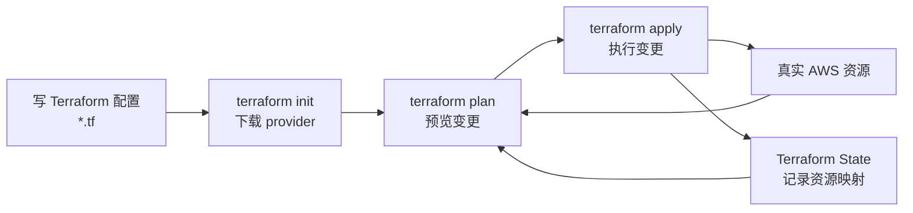
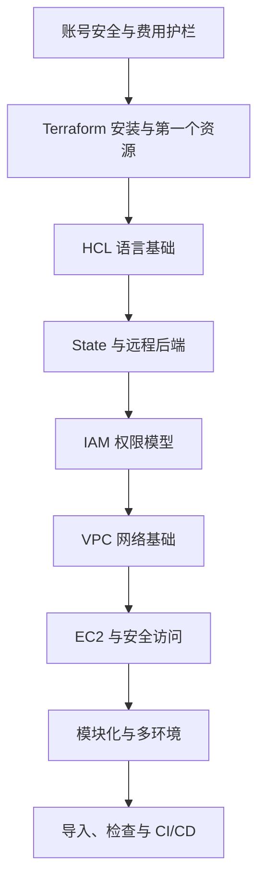

> **这是《Terraform + AWS 从零到工程化》系列的第 1 篇。**
> 这个系列会从一个 Terraform 小白的视角出发：不假设你已经熟悉 AWS，也不假设你已经理解基础设施即代码。
> 我们会先把账号安全、费用控制和基本概念讲清楚，再逐步进入 S3、IAM、VPC、EC2、模块化、远程状态和 CI/CD。

我刚开始接触 Terraform 时，最容易冒出来的冲动是：赶紧安装，赶紧写一个 `.tf` 文件，赶紧 `terraform apply`。

这个冲动很正常。Terraform 最吸引人的地方，就是你写几行配置，就能让云上的资源被创建出来。

但如果你手里刚好也有一个新 AWS 账号，我建议第一步先慢下来。因为云平台和本地开发最大的区别是：本地代码写错了，大多只是报错；云上资源创建错了，可能会产生账单，也可能暴露权限。

所以这个系列的第一篇，不从代码开始，而是从三个问题开始：

1. 如何避免账号被 Root 用户长期直接操作？
2. 如何避免学习过程中忘记删除资源而产生费用？
3. 如何先建立 Terraform 的基本心智模型？

等这三件事想清楚，再写第一份 Terraform 配置，心里会踏实很多。

## 一、这个系列想解决什么问题

Terraform 是 Infrastructure as Code，也就是基础设施即代码。

它的目标不是让我们少点几次控制台按钮，而是让基础设施变得：

- **可复现**：换一台电脑、换一个人，也能创建出同样的环境；
- **可审查**：一次变更到底会新增、修改、删除什么，可以在执行前看到；
- **可版本化**：网络、服务器、权限、存储这些东西，也能像应用代码一样进入 Git；
- **可回滚和重建**：环境坏了，不靠记忆手工修，而是回到代码和状态本身。

不过这些好处不是一上来就自动获得的。

Terraform 有自己的学习曲线，尤其是下面几件事：

- HCL 语法看起来简单，但变量、类型、表达式、模块组合起来以后并不简单；
- `terraform.tfstate` 是核心，理解不了 state，就很难理解 Terraform 为什么这么做；
- AWS 的权限模型很细，IAM 配错了，不是权限不足，就是权限过大；
- 云资源有成本，学习时必须养成创建、验证、销毁的习惯；
- Terraform 执行的是“真实基础设施变更”，不是普通脚本练习。

所以这个系列会尽量按“先保命，再上路”的节奏来写。

## 二、先给新 AWS 账号加护栏

如果你是刚创建 AWS 账号，我建议先完成下面几件事。它们不一定都要用 Terraform 管理，尤其是账号最初的安全设置，很多时候应该先在控制台完成。

### 1. Root 用户开启 MFA

AWS 账号刚创建时，会有一个 Root user。这个身份拥有账号里的最高权限。

日常学习和操作不应该依赖 Root 用户。AWS 官方也建议：除非必须执行只能由 Root 完成的任务，否则不要使用 Root 用户；同时应该为 Root 用户启用 MFA。

我的理解是：Root 用户应该像保险柜钥匙，而不是每天揣在手里的门禁卡。

建议动作：

- 设置强密码；
- 启用 MFA，最好不要只依赖一个容易丢失的设备；
- 不要给 Root 用户创建 Access Key；
- Root 登录邮箱、手机号等恢复渠道要保持可用；
- 后续日常操作使用 IAM Identity Center、IAM Role 或专门的 IAM 用户。

### 2. 打开预算告警

学习 AWS 时，预算告警不是可有可无的装饰，而是安全带。

AWS Budgets 可以用来跟踪成本和用量，并在达到阈值时通知你。对个人学习账号来说，第一条预算可以设置得很低，例如 1 美元、5 美元或你愿意接受的学习成本上限。

预算告警不能阻止所有费用产生，但它能尽早提醒你：某个资源可能忘了删，某个服务可能超出了免费额度，某个实验可能比想象中贵。

建议动作：

- 创建一个月度成本预算；
- 设置多个阈值，例如 50%、80%、100%；
- 绑定常用邮箱；
- 每次实验结束后检查 Billing 和 Cost Explorer；
- 养成 `terraform destroy` 或手工清理资源的习惯。

### 3. 选择默认学习区域

AWS 有很多 Region。对学习来说，最好先固定一个区域，避免资源散落到不同地方。

我会优先选择：

- 离自己网络较近；
- 常用服务支持完整；
- 文档、示例、社区讨论较多；
- 自己能记住并长期使用。

例如可以先固定 `ap-southeast-1`、`ap-northeast-1`、`us-east-1` 这类常见区域中的一个。具体选哪个，要结合你的网络、服务支持和费用。

后面的示例会把 Region 写成变量，而不是散落在每个资源里。

## 三、Terraform 的第一张心智地图

先不看语法，Terraform 的工作流可以理解成这样：



这张图里最重要的是三个东西。

第一是 **配置**。你在 `.tf` 文件里声明自己想要什么，例如一个 S3 Bucket、一台 EC2、一个 VPC。

第二是 **真实资源**。Terraform 最终会通过 AWS API 创建、修改或删除它们。

第三是 **State**。Terraform 需要记录“代码里的这个资源”和“AWS 上那个真实资源”之间的对应关系。

很多新手一开始只关心配置，但真正让 Terraform 变得强大、也容易踩坑的地方，正是 state。

## 四、Terraform 不是“云资源生成器”

如果只把 Terraform 当成一个“创建云资源的命令行工具”，很快就会遇到困惑。

比如：

- 为什么我手动在控制台改了资源，Terraform 下次 plan 会发现差异？
- 为什么删除一行配置，Terraform 可能要删除云上的真实资源？
- 为什么 `.tfstate` 不能随便删？
- 为什么多人协作时不能每个人都用自己的本地 state？
- 为什么同一个模块在不同环境里要传不同变量？

这些问题背后，其实是同一个核心：Terraform 管理的是“期望状态”和“真实状态”之间的收敛过程。

你写的配置描述期望状态。AWS 上已有的资源是真实状态。Terraform 通过 provider 和 state 去比较两者，然后生成一份执行计划。

所以后面每次执行前，都要认真看 `terraform plan`。

`plan` 不是一个形式步骤，而是 Terraform 给你的一次变更审查机会。

## 五、这个系列的学习路线

我准备按下面的顺序学习和写作：



大致会拆成这些文章：

1. 先别急着写代码，保护你的新 AWS 账号；
2. IaC 到底解决了什么问题；
3. 第一个资源：从 S3 Bucket 开始；
4. HCL 语言基础：变量、输出、表达式；
5. State：Terraform 的灵魂；
6. 远程状态后端：用 S3 保存 state；
7. IAM：用最小权限运行 Terraform；
8. VPC：从零搭一个网络；
9. EC2：创建一台可安全访问的服务器；
10. Module：从能跑到能维护；
11. 多环境：dev、staging、prod 怎么分；
12. Plan 审查：如何避免误删资源；
13. Import：把手工资源纳入 Terraform；
14. 静态检查与安全扫描；
15. GitHub Actions 自动化 Terraform 流程；
16. 用一个完整小项目收官。

这个路线不追求一篇文章塞满所有概念。每篇只解决几个问题，配一组可运行的例子，最后把资源清理干净。

## 六、第一篇先不写代码，是有意的

很多教程从 `main.tf` 开始，这当然没错。Terraform 官方入门教程也是从安装、创建资源、管理资源、销毁资源这样的路径推进。

但我现在更想先补上学习者真实会遇到的上下文：

- 我刚创建 AWS 账号，哪些东西必须先设置？
- 我如何确保学习不会产生不可控费用？
- Terraform 和 AWS 控制台到底是什么关系？
- 为什么同一个资源不能一会儿手动改、一会儿 Terraform 改？
- 为什么大家总说 state 很重要？

这些问题不先讲，后面写代码时就会像在雾里开车。

下一篇开始，我们再安装 Terraform 和 AWS CLI，并用一个尽量低风险的资源，完整走一遍：

```bash
terraform init
terraform fmt
terraform validate
terraform plan
terraform apply
terraform destroy
```

第一篇的目标很朴素：先知道自己在操作什么，再开始操作。

## 参考资料

- [Terraform AWS Get Started](https://developer.hashicorp.com/terraform/tutorials/aws-get-started)
- [Terraform Language Documentation](https://developer.hashicorp.com/terraform/language)
- [Terraform State](https://developer.hashicorp.com/terraform/language/state)
- [AWS Root user best practices](https://docs.aws.amazon.com/IAM/latest/UserGuide/root-user-best-practices.html)
- [Creating a budget - AWS Cost Management](https://docs.aws.amazon.com/cost-management/latest/userguide/budgets-create.html)
